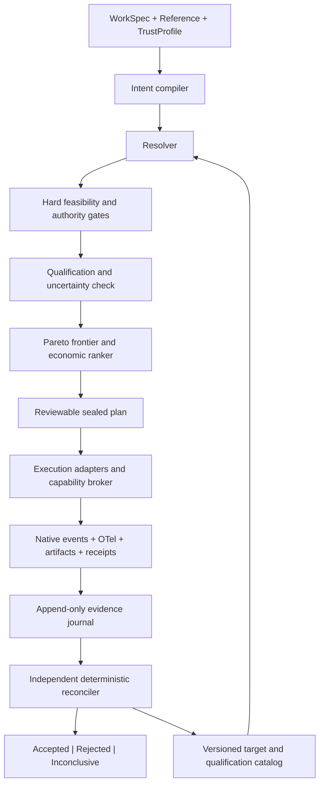

# Envelope design foundations and experiment program

> **Historical research record.** This document preserves the assumptions and recommendations made on its research date.

- **Research date:** July 10, 2026
- **Scope:** research input; no implementation or experiments were performed as part of this report
- **Starting point:** original thesis draft

**Method:** synthesis of the source thesis with primary standards and specifications, official system documentation, peer-reviewed/formal-methods literature, and current primary agent-evaluation research. Current product and policy claims are time-stamped to the research date. Architecture recommendations are inferences from those sources; proposed experiments are designs, not observed results.

## Executive conclusion

Envelope can be a coherent and unusually ambitious systems project, but only if its center is drawn more narrowly than “a platform for trustworthy AI.” The strongest technical definition is:

> **Envelope is an assurance-aware qualification, planning, and reconciliation layer for probabilistic computation. It decides whether a complete execution target is admissible for declared work, explains what is known and unknown before execution, and determines afterward whether the evidence supports acceptance.**

This is distinct from, but composes with, an inference gateway, workflow engine, policy engine, evaluation platform, provenance ledger, and infrastructure provisioner. The gap is real: current systems can route to models, authorize actions, trace agent calls, attest hardware and software identity, or score outcomes. They generally do not join those facts into a scoped, time-bounded claim that a complete computation environment is qualified for a class of organizational work at a measured trusted-completion cost.

The strongest part of the existing thesis is also the most important to refine. There are at least three different geometric objects hiding under the word *Envelope*:

1. **The admissible region:** configurations that satisfy hard constraints and evidence thresholds.
2. **The qualified frontier:** non-dominated admissible configurations trading cost, latency, human attention, assurance, and other objectives.
3. **The declared operating boundary:** the conditions under which a target's qualification claim is intended to hold.

Those are related, but they are not interchangeable. A Pareto frontier need not be continuous or closed; the set of configurations is partly discrete; model and provider behavior is stochastic and time-varying; and many important dimensions are unobservable. Therefore, Envelope should not promise discovery of a literal smooth, topologically closed surface. It can make the more defensible claim that it constructs a **conservative, evidence-bounded approximation of an acceptance region relative to an explicit state space**, with abstention wherever coverage or evidence is insufficient.

That correction strengthens rather than diminishes the ambition. It turns the geometric passage into an implementable research program:

- define the state space;
- establish which configurations are comparable;
- learn or measure outcome distributions;
- enforce deterministic constraints;
- estimate uncertainty around probabilistic constraints;
- identify non-dominated qualified configurations;
- monitor whether execution remains within its operating domain;
- record exactly where the claim stops.

The timing is unusually good. In 2026, NIST launched an [AI Agent Standards Initiative](https://www.nist.gov/artificial-intelligence/ai-agent-standards-initiative) around secure interoperability, identity, and evaluation; separately documented that deployed-AI monitoring remains fragmented and lacks trusted methods in [NIST AI 800-4](https://www.nist.gov/publications/challenges-monitoring-deployed-ai-systems-center-ai-standards-and-innovation); and argued in [NIST AI 800-3](https://www.nist.gov/publications/expanding-ai-evaluation-toolbox-statistical-models) that AI evaluation needs explicit statistical estimands, assumptions, and uncertainty. Meanwhile, Kubernetes is standardizing inference endpoint selection around performance and capacity through the [Gateway API Inference Extension](https://gateway-api-inference-extension.sigs.k8s.io/), agent protocols are standardizing connection and discovery, and OpenTelemetry is developing GenAI and agent trace semantics. The missing layer is not “more telemetry.” It is the disciplined conversion of heterogeneous telemetry, tests, attestations, policies, and human judgments into a decision-scoped assurance argument and an economic comparison.

The principal recommendation is therefore:

> **Use reproducible experiments as the instrument. Treat Envelope's first research object as a typed assurance case over a qualified target—not a language, router, or runtime.**

If five heterogeneous experiments cannot produce stable semantics for that object, the broad platform thesis is falsified or must narrow. If they can, the later resolver and execution toolchain will have a defensible thin waist.

## 1. What is genuinely new, and what is composition

Envelope should be evaluated against the best existing component in each layer, not against an imaginary empty market.

| Existing system family | What it already does well | What it does not establish | What Envelope should reuse |
|---|---|---|---|
| [Terraform](https://developer.hashicorp.com/terraform/cli/commands/plan) and infrastructure-as-code | Typed configuration, provider lowering, plan/apply separation, immutable provider/version locks, explicit unknown values, drift | Whether nondeterministic computation produced an acceptable result or enough evidence to trust it | Plan semantics, known/unknown values, provider contracts, immutable resolution, drift reporting |
| [Kubernetes schedulers](https://kubernetes.io/docs/concepts/scheduling-eviction/kube-scheduler/) and inference gateways | Resource feasibility, endpoint health, queueing, cache-aware or load-aware placement, latency/utilization optimization | Work-level quality, custody, evaluator validity, human-review burden, residual uncertainty | Endpoint discovery and execution; do not rebuild scheduling |
| RouteLLM, FrugalGPT, semantic routers | Learned or rule-based model choice for quality/cost trade-offs | Hard policy gates, full target identity, evidence sufficiency, post-run reconciliation | Later ranking models, only after deterministic admissibility |
| [OPA/Rego](https://www.openpolicyagent.org/docs) and [Cedar](https://docs.cedarpolicy.com/) | Deterministic policy evaluation over structured facts; authorization and decision logs | Whether the facts are true, whether an outcome is correct, or whether a stochastic target is reliable | Policy decision point and versioned policy identity |
| [Temporal](https://docs.temporal.io/), Argo, and durable workflow engines | Retries, recovery, event history, activity isolation, long-running workflows | Qualification of the model/runtime/environment and acceptance of the semantic outcome | Execution substrate when experiments require durability |
| OpenTelemetry and GenAI observability products | Correlated spans, metrics, logs, model/tool/session attributes, operational debugging | Tamper-evident audit, complete capture, evidence independence, assurance reasoning | Operational signal transport and common attribute vocabulary |
| W3C PROV, in-toto, SLSA, Sigstore | Provenance graphs, subject/predicate attestations, signatures, offline verification, transparency logs | Truth of a behavioral claim merely because it was signed; stochastic validity | Provenance vocabulary, content-addressed subjects, signed attestations |
| [SPIFFE/SPIRE](https://spiffe.io/docs/latest/spiffe-about/overview/), OAuth, workload identity | Cryptographic workload identity and delegated authorization | Behavioral qualification or model-output correctness | Actor/target identity and delegation chain |
| RATS/EAT and confidential computing | Hardware/software evidence, appraisal against reference values, conditional secret release | Correctness of the application or model output | High-strength custody and platform-integrity evidence |
| Evaluation and experiment platforms | Datasets, graders, traces, comparisons, regression testing | A portable, target-level assurance contract spanning infrastructure, policy, and economics | Grader adapters and raw experimental evidence |
| [MLPerf/MLCommons](https://github.com/mlcommons/inference_policies/blob/master/inference_rules.adoc) | Controlled system definitions, reproducibility rules, audited performance comparison | Organizational acceptability of open-ended agentic work | Reference discipline, system descriptions, audit patterns |
| SACM/GSN assurance cases | Structured claims, arguments, evidence, counterclaims, and context | Live resolution and execution by itself | The semantic model for reconciliation |

The novel contribution is the **join** across these systems, but “integration” understates the research difficulty. The join requires new semantics:

- qualification is relational: a target is qualified **for work, under a profile, within a validity interval**;
- evidence is heterogeneous and has issuers, scopes, collection methods, independence, and uncertainty;
- acceptance combines deterministic and probabilistic claims without collapsing them into one score;
- cost includes the controls and attention necessary to make the result acceptable;
- a result may be functionally correct while the execution is untrustworthy, or impeccably attested while the result is wrong;
- a plan must explain infeasibility and missing evidence, not merely select something;
- drift can invalidate qualification even if the endpoint name has not changed.

That is a credible systems category. It ceases to be credible if Envelope attempts to own provisioning, generic workflow execution, all telemetry storage, policy authoring, evaluation authoring, and model serving. Those should remain replaceable substrates.

## 2. Repairing the geometric interpretation

### 2.1 A minimal formal model

Let a resolved computation configuration be

\[
x = (w, r, t, e, c, v)
\]

where:

- \(w\) is the declared work and its context;
- \(r\) is the stable behavioral or outcome reference;
- \(t\) is the complete target identity;
- \(e\) is the environment and placement;
- \(c\) is the selected set of controls and verification procedures;
- \(v\) is the versioned evaluator and evidence contract.

Execution produces a random outcome and trace

\[
(Y, Z, K) \sim P_{x,\tau}
\]

where \(Y\) is the work product, \(Z\) is collected evidence, \(K\) is realized cost, and \(\tau\) denotes time or operating regime. This notation matters: even when temperature is zero, managed systems, tools, networks, concurrency, retrieval, and hidden provider changes can make the system nondeterministic.

A trust profile \(p\) should define five kinds of predicates, matching the experimental framing:

- **functional:** did the result do the required job?
- **conformance:** did behavior and interfaces conform to the reference?
- **custody:** were data, tools, authority, placement, and retention acceptable?
- **assurance:** is the evidence sufficient and sufficiently independent for the claim?
- **economic:** did the run remain within cost, latency, attention, and teardown limits?

Some predicates are knowable before execution. Others are runtime invariants. Others are statistical claims that can only be supported by prior trials and monitored after deployment.

Define deterministic feasibility as

\[
D_p(x) = \bigwedge_j d_j(x),
\]

where \(d_j\) covers requirements such as region, model license, tool allowlist, maximum authority, artifact identity, provider retention terms, or required evidence availability.

Define runtime conformance for an execution history \(h\) as

\[
R_p(h) = \bigwedge_k r_k(h),
\]

where monitors can enforce budget, TTL, allowed state transitions, approvals, and teardown.

Define probabilistic qualification claims as, for example,

\[
\Pr(q_l(Y,Z)=1 \mid x, \mathcal{D}) \ge 1-\epsilon_l
\]

with a declared confidence level \(1-\delta_l\), workload distribution \(\mathcal{D}\), and validity interval. A claim without \(\mathcal{D}\), \(\epsilon\), \(\delta\), and time scope is not a reliability claim; it is an observation.

The admissible region is then

\[
\mathcal{A}_{p,\tau} = \{x : D_p(x)=1,\; \widehat{Q}_{p,\tau}(x)=1,\; E_p(x)\text{ is sufficient}\}.
\]

Here \(\widehat{Q}\) is an evidence-backed statistical decision, not ground truth. The system must preserve that distinction.

The **qualified frontier** is the subset of \(\mathcal{A}\) not dominated on the declared economic and operational objectives. It can include dollars, wall time, review-minutes, latency tails, energy, and assurance burden. Hard custody or safety requirements do not belong in the objective function; they are feasibility gates.

There are three sets that must not be conflated:

1. the **latent acceptable set**—configurations whose true outcome distribution satisfies the declared requirements;
2. the **empirically qualified set**—configurations the finite evidence and decision rule allow the system to pass;
3. the **currently viable set**—configurations that are also available, authorized, and inside fresh runtime constraints now.

Only the second and third are computable, and both can be wrong about the first. A qualification procedure should therefore be designed around a false-qualification bound, for example

\[
\sup_{x \notin \mathcal{A}^{\star}} \Pr_x\{\delta(E)=\text{Pass}\} \le \alpha,
\]

where \(\mathcal{A}^{\star}\) is the unknown true acceptable set, \(E\) is collected evidence, and \(\delta\) is the three-valued decision rule. The experiment must state which assumptions make such a bound credible; otherwise it is a target, not a guarantee.

An assume–guarantee contract is a useful more primitive definition than geometry. A reference can be modeled as

\[
R=(W,\mathcal{D},\Phi,T,M,V),
\]

where \(W\) is the work family, \(\mathcal{D}\) its workload/operating distribution, \(\Phi\) required trace and outcome properties, \(T\) timing semantics, \(M\) measurement/observation model, and \(V\) validity/defeater rules. A target's guarantee is meaningful only while environment assumptions hold. The admissible region and frontier are *derived views* over these contracts and evidence—not the semantic foundation themselves.

### 2.2 Why literal topological closure is too strong

Calling the frontier “closed” in a mathematical sense would require a topology over the configuration space and conditions under which limit points remain inside the set. The real space violates the convenient assumptions:

- model, runtime, quantization, provider, and hardware choices are categorical;
- tool permissions and controls change in discrete steps;
- agent trajectories contain branches and side effects;
- quality functions are noisy, discontinuous, and often observable only through imperfect graders;
- providers expose incomplete identities;
- workload distributions and prices drift;
- evidence can expire without a configuration changing;
- Pareto fronts can contain gaps and disconnected components.

Strictly, the boundary of any set is closed in the standard topological definition, so saying “the boundary is closed” alone adds no useful guarantee. The substantive questions are: relative to which topology and declared state space; whether the *qualified set* contains its relevant limit points; whether the trace property is safety-closed; and whether the assurance argument and run record are complete under explicit obligations.

Multi-objective optimization still provides the right concept of non-dominated trade-offs. Z3, for example, explicitly supports [Pareto objective combination](https://microsoft.github.io/z3guide/docs/optimization/combiningobjectives/), while the operations-research literature treats discontinuous feasible regions as normal rather than pathological. But continuity should be a hypothesis tested within a local experimental neighborhood, never an assumed property of “AI computation” generally.

The project should use four operational closure terms instead:

1. **Schema-closed:** every dimension required by the profile is present, explicitly unknown, unavailable, or out of scope.
2. **Constraint-closed:** every hard constraint has a determinate result and the accepted configuration satisfies all of them.
3. **Evidence-closed:** every acceptance claim has the required evidence or an explicit unresolved defeater.
4. **Run-closed:** execution terminated, teardown and retention obligations were reconciled, and the decision record is complete.

An Envelope may be closed in all four senses while explicitly stating that its statistical claim covers only a sampled workload distribution and a bounded time interval. This is much more useful than implying containment of unknown unknowns.

The base space should initially be a **hybrid intervention graph**, not a Euclidean vector space. Nodes are fully resolved computation objects. An edge means that one declared, executable intervention transforms one node into another: swap quantization, change a route, upgrade a runtime, reduce tool scope, enable deterministic scheduling, or replace an evaluator. Continuous local charts may exist for parameters such as budget, temperature, concurrency, or batch size, but only inside a fixed categorical neighborhood. This provides an operational definition of “nearby” and makes boundary discovery a sequence of experiments rather than an aesthetic surface-fitting exercise.

### 2.3 The closest mature analogy is an operational design domain

Terraform is the right interaction analogy, but safety engineering supplies the closer boundary analogy. ISO 34503 defines an automated-driving [operational design domain](https://www.iso.org/standard/78952.html) as the static and dynamic conditions within which a system is designed to function. NIST went further with an [Operating Envelope Specification](https://www.nist.gov/news-events/news/2021/12/nist-proposes-operating-envelope-specification-concept-support-automated), a structured description intended to support calculation-based reasoning, testing, certification, and runtime decisions.

The transferable lesson is precise:

- the domain is a claim about conditions, not a claim of universal capability;
- deployment conditions must be checked against the qualified domain;
- the domain needs a taxonomy before it can support measurement;
- scenario coverage and runtime monitoring are separate problems;
- leaving the domain requires a fallback or refusal mode.

For Envelope, “fail closed” is the analogue of refusing to activate outside the operational design domain. For agents, a richer fallback hierarchy will be necessary: retry safely, reduce authority, route to a more qualified target, request human intervention, produce an advisory-only result, or terminate and compensate side effects.

### 2.4 Comparability is the real prerequisite

Two configurations should be admitted into the same experimental family only when all of the following are defensible:

1. **Reference equivalence:** they are judged against the same versioned contract or a proved transformation of it.
2. **Workload support:** the evaluation tasks are sampled from the same declared population, or a shift model is explicit.
3. **Outcome semantics:** success and failure mean the same thing; one target is not being credited for a weaker job.
4. **Measurement invariance:** the evaluator does not systematically favor one target, output style, or interface.
5. **Cost boundary:** both include equivalent cost categories and time horizons.
6. **Identity resolution:** each target is identified as deeply as its claims require.
7. **Control equivalence:** differences in harness, tools, retries, context, or human help are experimental variables, not hidden confounders.
8. **Temporal relevance:** qualifications overlap in time or drift is modeled.

Comparability should be a typed relation, not a Boolean global property. Targets may be comparable for functional quality but incomparable for custody; comparable for steady-state latency but not cold-start economics. The resolver should preserve partial orders and return “incomparable under this profile” rather than manufacturing a total ranking.

## 3. The foundational semantic object: a qualification claim

The first stable Envelope abstraction should not be `Envelope`, `Provider`, or `Run`. It should be a versioned claim of this form:

\[
Q(t, w, p, r, \tau) \rightarrow (status, evidence, uncertainty, defeaters)
\]

In plain language:

> Target revision **t** is qualified for work class **w**, under trust profile **p** and reference **r**, during validity interval **τ**, because this evidence supports these claims with these uncertainties and unresolved defeaters.

The status vocabulary should be small and non-ordinal:

- `qualified`
- `not_qualified`
- `insufficient_evidence`
- `expired`
- `incomparable`
- `invalidated_by_drift`

“Qualified” must not imply “safe,” “correct,” or “trusted” without the rest of the sentence. Qualification is scoped, relational, and revocable.

### 3.1 Claims, evidence, and telemetry are different things

A useful semantic model comes from structured assurance cases. The Object Management Group's [Structured Assurance Case Metamodel](https://www.omg.org/spec/SACM/About-SACM) represents auditable claims, argument structure, and evidence. W3C PROV provides interoperable concepts for [entities, activities, agents, derivation, attribution, and plans](https://www.w3.org/TR/prov-o/). The in-toto [Attestation Framework](https://github.com/in-toto/attestation/blob/main/spec/README.md) binds a typed predicate to content-addressed subjects and an authenticated envelope.

Envelope should compose those ideas:

- **telemetry** is an observation emitted during operation;
- **artifact** is immutable content addressed by a digest;
- **attestation** is an authenticated statement by an identified issuer about a subject;
- **evidence** is an artifact or attestation admitted under an evidence contract;
- **claim** is a proposition the decision needs;
- **argument** explains why admitted evidence supports or defeats the claim;
- **decision** applies a trust profile to the resulting claim graph.

A signed statement can still be false. A complete trace can still omit the event that matters. Hardware attestation can establish platform state without establishing output correctness. Passing tests can establish conformance to those tests without establishing the evaluator's construct validity. This is why a single linear “evidence level” is tempting but wrong.

Evidence strength should instead be described along independent axes:

- issuer identity and trust domain;
- collection position (provider, client, independent observer, hardware root);
- integrity and tamper evidence;
- reproducibility;
- freshness and validity window;
- directness with respect to the claim;
- evaluator independence;
- sampling coverage and statistical uncertainty;
- disclosure completeness;
- known counterevidence or defeaters.

### 3.2 Candidate evidence record

Every experiment should be capable of emitting an evidence record with these semantic fields, even if the physical format remains ordinary JSON:

| Field group | Minimum content |
|---|---|
| Identity | evidence ID, schema version, predicate type |
| Subject | one or more immutable digests or provider-qualified resource IDs |
| Claim linkage | claims supported, contradicted, or scoped |
| Provenance | producer, collector, verifier, collection method, tool versions |
| Time | observed-at, issued-at, validity interval, expiration rule |
| Scope | workload/reference/profile dimensions for which it is relevant |
| Result | measurement, units, distribution or interval, pass/fail when appropriate |
| Integrity | artifact digest, signature/bundle, transparency proof when applicable |
| Disclosure | redactions, sampling, unavailable fields, known omissions |
| Independence | relationship among target, evaluator, collector, and issuer |
| Raw material | content-addressed links to trace, test output, bill, review log, or attestation |

This object is intentionally more rigorous than a telemetry span and less prescriptive than a universal assurance ontology.

### 3.3 Evidence validity must decay

Qualification should be invalidated or downgraded by predicates, not arbitrary calendar TTL alone:

- model alias or snapshot changed;
- provider terms, retention, or placement behavior changed;
- price schedule changed beyond the declared tolerance;
- evaluator/reference version changed;
- image, weights, runtime, driver, hardware, or policy digest changed;
- behavior-monitoring detects distribution shift;
- a new failure or incident defeats a prior claim;
- the qualification's maximum age elapsed.

This makes the catalog an append-only history of qualification episodes, with a derived current view. Mutation of a “current target record” must never erase the evidence under which an earlier decision was made.

## 4. Trace semantics: what a run must prove

The object being qualified is not only a point in a configuration table. Agentic work unfolds as a trace of observations, decisions, delegated actions, external side effects, retries, and teardown. This matters because endpoint correctness and trajectory acceptability are different properties.

Let a trace be

\[
\tau = (s_0, a_0, o_1, s_1, a_1, o_2, \ldots, s_T)
\]

where `s` is system state, `a` is an action, and `o` is an observation or receipt. A completion predicate may hold at `s_T` even though an impermissible action occurred earlier. Conversely, a correct process may end inconclusively because the observer could not see a necessary fact.

### 4.1 Safety, bounded liveness, and monitorability

The classic safety/liveness distinction is useful here. Safety says that “nothing bad happened” and is refutable by a finite bad prefix. Liveness says that “something good eventually happens” and generally cannot be decided from an arbitrary finite prefix. The distinction is topological as well as operational: safety properties are closed trace sets in the standard topology, while liveness properties are dense. See [Alpern and Schneider's foundational treatment](https://doi.org/10.1016/0020-0190%2885%2990056-0).

Envelope should turn open-ended obligations into bounded, monitorable ones wherever the work permits it:

- “the lease is eventually released” becomes “a valid release receipt exists by deadline `d`”;
- “the job eventually terminates” becomes “the job enters a terminal state before its declared time budget”;
- “the agent will not exceed authority” becomes a safety property enforced and logged at every brokered action;
- “the output remains correct forever” cannot be a per-run acceptance claim and must become a time-scoped monitoring or revalidation obligation.

Runtime monitors also have a third outcome: a finite prefix can be neither a proof nor a counterexample. That is another reason the reconciler needs `Pass | Fail | Inconclusive`, not a coerced Boolean. [Runtime-verification research](https://doi.org/10.1145/2000799.2000800) provides a useful vocabulary for monitorable, co-monitorable, and non-monitorable properties.

### 4.2 Some trust properties are hyperproperties

Custody, noninterference, consistency, and certain fairness or information-flow claims relate *sets of traces*, not one trace. A JSONL log from one successful run cannot prove that sensitive input never changes an unauthorized output path, nor that two users are isolated under otherwise equal conditions. These are hyperproperties in the sense of [Clarkson and Schneider](https://doi.org/10.3233/JCS-2009-0393).

This creates a hard architectural rule: every predicate must declare its evidence cardinality.

| Predicate kind | Typical evidence unit |
|---|---|
| Single-event | one authenticated receipt or observation |
| Single-trace | a sufficiently complete run trace |
| Repeated-trial | a sample of traces under a declared protocol |
| Relational/hyperproperty | paired or structured families of traces |
| Longitudinal | traces across time plus drift/change records |
| Environmental | independent platform, network, billing, or organizational evidence |

### 4.3 Observability is an identifiability condition

Let `O` map latent execution traces to available evidence. Evidence `e` is sufficient to prove property `phi` only if every execution consistent with it satisfies the property:

\[
O^{-1}(e) \subseteq \phi.
\]

If an acceptable and unacceptable execution can produce the same evidence, the property is not identifiable under the current instrumentation. The correct decision is `Inconclusive`, and the design question is what additional observer or control would separate those executions. This gives “evidence closure” a concrete interpretation: the declared observer graph must be able to distinguish the decisions the acceptance policy asks it to make.

### 4.4 Agentic envelopes may need a viability interpretation

For long-running agents, a more faithful geometric object may be a viability or reach-avoid set. Let dynamic state include remaining budget, credential leases, open side effects, unresolved obligations, context, and time. The relevant question is not only whether the current state is acceptable, but whether a policy still exists that can reach a goal set without leaving the safe set:

\[
z_{t+1} \sim P(\cdot \mid z_t, a_t), \qquad
z_t \in K, \qquad
\Pr(\text{reach } G \text{ before exiting } K) \ge 1-\alpha.
\]

[Viability theory](https://doi.org/10.1007/978-3-642-16684-6) is therefore a promising rabbit hole for budget-aware agent control, especially when an agent can still be technically “running” but no longer has a safe path to trusted completion. This should remain a research model until experiments demonstrate a need for online reachability rather than simple phase gates.

## 5. Candidate Envelope architecture

The architecture research suggests a thin semantic core surrounded by adapters to existing systems. It should reuse mechanisms and own only the missing cross-layer meaning.



### 5.1 The thin waist

Envelope should own:

- a typed intermediate representation for work, references, composite targets, qualifications, plans, evidence obligations, and decisions;
- three-valued constraint and evidence semantics;
- target-class qualification and validity rules;
- global hard-filter-then-rank resolution;
- evidence-satisfiability analysis;
- explainable plan sealing and drift rules;
- deterministic reconciliation over a committed evidence bundle;
- trusted-completion economics.

Envelope should initially *not* own:

- generic infrastructure provisioning;
- a model-serving engine or local replica scheduler;
- general workflow orchestration;
- a universal policy language;
- a telemetry database or dashboard;
- a new artifact-signing or workload-identity system;
- a generic agent framework or tool protocol.

The existing mechanisms are strong: Terraform and Kubernetes for plans/control loops; CUE for structural constraints; OPA and Cedar for policy and action authorization; Temporal for durable orchestration; Gateway API, Dynamo, Ray, or provider gateways for replica routing; OCI, SPDX, and CycloneDX for artifact structure; SPIFFE for workload identity; in-toto, SLSA, Sigstore, and W3C PROV for provenance; OpenTelemetry for collection and correlation; OpenCost and FOCUS for billing; and RATS/EAT for platform attestation. None, however, owns the end-to-end semantic chain from work-specific qualification through trusted-cost reconciliation.

### 5.2 Logical components

| Component | Responsibility | Important non-responsibility |
|---|---|---|
| Intent compiler | Canonicalize work, reference, profile, and evidence obligations into a stable IR | Does not choose a target |
| Identity resolver | Freeze mutable locators into the most immutable identity closure available | Does not pretend managed-provider internals are knowable |
| Candidate enumerator | Produce target-class snapshots and explicit unknowns | Does not score |
| Hard-gate engine | Evaluate capability, custody, authority, placement, budget ceilings, and evidence feasibility | Cannot trade a violation for lower cost |
| Qualification engine | Check scope, uncertainty, applicability, freshness, and defeaters | Does not convert missing evidence into low confidence |
| Economic ranker | Compute a visible Pareto frontier and experiment-declared loss/utility ordering | Does not emit a universal trust score |
| Planner | Lower the chosen target into a sealed run graph and phase gates | Cannot silently approximate semantics |
| Run coordinator | Execute durably through adapters; broker capabilities and approvals | Does not certify its own success |
| Evidence journal | Preserve authenticated native observations and their provenance | Is not merely an OTel backend |
| Reconciler | Deterministically evaluate committed evidence against the acceptance contract | Must be separable from the target/provider for material claims |
| Catalog projector | Derive current target/qualification state from append-only history | Never rewrites historical decision context |

### 5.3 Provisional records, not a premature language

These are research records to preserve across experiments, not proposed surface syntax.

| Record | Core meaning |
|---|---|
| `WorkSpec` | Task class, schemas, side-effect model, limits, and equivalence relation |
| `Reference` | Oracle, baseline, expected properties, evaluator relationship, and known blind spots |
| `TrustProfile` | Hard predicates, evidence strength requirements, approval rules, and declared loss model |
| `TargetManifest` | Composite target-class identity, capabilities, claims, unknowns, and provider snapshot |
| `Qualification` | Time-scoped empirical claim for a target family × work × profile × reference domain |
| `Plan` | Catalog/policy snapshots, candidates, rejections, selected target, assumptions, DAG, and evidence contract |
| `RunEvent` | Ordered observation bound to plan, run, producer, phase, time, and prior event |
| `Evidence` | Typed support/counterevidence with native provenance, integrity, scope, and validity |
| `Decision` | Predicate results, evidence coverage, drift, trusted-cost ledger, uncertainty, and disposition |
| `DriftEvent` | Physical, behavioral, policy, price, evaluator, or evidence-capability change |

The fundamental catalog object should be the qualification claim

\[
Q(\text{target family},\ \text{work class},\ \text{profile},\ \text{reference},\ \text{time})
\]

rather than a timeless declaration that a provider or model is “trusted.”

### 5.4 Identity must be layered

At least four identities are needed:

1. **Artifact identity:** code, weights, images, evaluator, and data digests.
2. **Target-class identity:** artifact closure plus runtime, hardware class, harness, tools, policy, custody, and evidence profile.
3. **Target-instance identity:** workload identity, placement, lease, and platform measurements for one execution.
4. **Behavioral qualification identity:** the empirical record binding a target class to a work/reference validity domain.

Managed targets and self-hosted targets have different epistemic structures. A self-hosted target may expose weight, image, driver, kernel, and hardware identities while still hiding physical faults or supply-chain truth. A managed target may expose only a provider-qualified model ID, route, region policy, request settings, receipts, and contractual assertions. Envelope must preserve those differences rather than collapsing both into a fake universal digest.

For managed inference, a defensible identity tuple includes provider/account, endpoint and pinned model ID if available, API/version, region or route policy, safeguard tier, sampling/reasoning settings, tool/schema identity, request-time headers, provider request IDs, observed processing region where exposed, price schedule, and observation time. Mutable aliases remain explicit claims, not identities.

### 5.5 Resolution algorithm

A defensible resolver proceeds in stages:

1. Canonicalize and schema-check work, reference, profile, constraints, and evidence requirements.
2. Snapshot catalogs, policies, prices, qualifications, and provider identities.
3. Resolve mutable locators as far as each provider permits; preserve every unresolved or provider-unavailable field.
4. Evaluate hard capability, custody, authority, side-effect, retention, placement, and maximum-cost constraints with explicit unknown propagation.
5. Check evidence satisfiability: for every acceptance predicate, confirm a viable property → measurement → producer → transport → store → verifier → decision path.
6. Confirm that qualification scope covers the exact target family, work class, reference, evaluator, protocol, and current drift state.
7. Reserve capacity and collect required approvals without releasing protected inputs.
8. Build a Pareto frontier over feasible targets for cost, latency, human attention, assurance properties, custody, and residual uncertainty.
9. Rank only that frontier using the experiment's declared utility or loss model; keep the vector visible.
10. Lower the target into a provider run graph and report unsupported, approximated, deferred, and provider-only semantics.
11. Emit counterfactual explanations and sensitivity around the binding constraints.
12. Seal the plan; revalidate leases, identities, policies, prices, and evidence readiness before protected-data release and irreversible actions.

The invariant is simple: a cheaper or faster score can never compensate for a failed hard predicate. Kubernetes' Filter → Score structure is a closer analogy than generic weighted routing. Kueue's externally controlled admission checks also resemble evidence or approval gates. See the [Kubernetes scheduler](https://kubernetes.io/docs/concepts/scheduling-eviction/kube-scheduler/) and [Kueue AdmissionChecks](https://kueue.sigs.k8s.io/docs/concepts/admission_check/).

### 5.6 Plans, run bundles, and state transitions

An experiment-level committed bundle can remain ordinary files:

```text
intent.json
lock.json
plan.json
events.jsonl
artifacts/
attestations/
decision.json
```

Their semantics matter more than their names. The plan must contain catalog and policy snapshots, selected identities, assumptions, unresolved obligations, evidence contract, phase gates, cost distribution, allowed fallbacks, teardown duties, and a digest binding them together.

A provisional state machine is:

```text
Declared
  → Resolved → Infeasible | Planned
  → AwaitingApproval → Authorized
  → Executing → Succeeded | Failed | Cancelled | TimedOut
  → Reconciling → Accepted | Rejected | Inconclusive
  → TearingDown → Closed | TeardownFailed
```

`Succeeded` is an execution state, never a trust decision. A correct output with an unreleased lease, missing billing tail, or failed cleanup can still be `Rejected` or `Inconclusive` under the declared profile.

### 5.7 Provider and protocol boundaries

An eventual provider should be out-of-process and capability-limited. Its conceptual operations are `describe`, `discover`, `resolve`, `quote`, `admit`, `lower`, `execute`, `observe`, `attest`, and `terminate`. It lowers a stable IR into native systems and returns a semantic-loss report. It does not own reconciliation.

For agents, MCP and A2A are adapter protocols rather than trust systems. [MCP tool annotations are explicitly untrusted unless the server is trusted](https://modelcontextprotocol.io/specification/2025-06-18/server/tools), and [A2A](https://github.com/a2aproject/A2A/blob/main/docs/specification.md) does not define an application-wide qualification or delegation policy. Consequential tool calls should therefore pass through a broker that binds actor and delegation chain, run/plan digest, action/schema, argument constraints, resource scope, budgets, expiry/revocation, approval, idempotency rules, and required receipts. Credentials stay out of model context.

Global target resolution and local replica routing must also remain separate. Envelope chooses a qualified equivalence class; a [Gateway API Inference Extension](https://gateway-api-inference-extension.sigs.k8s.io/), Dynamo, Ray, or cloud router may choose a healthy/cache-local replica only inside it. Crossing model snapshot, runtime, custody, tool, policy, or evidence-contract boundaries is replanning, not load balancing.

### 5.8 Evidence architecture

OpenTelemetry is the collection/correlation substrate, not the canonical assurance record. Its GenAI conventions are moving quickly and cover inference, agents, and tool executions, but sensitive payload fields and evolving semantics require caution. Required evidence needs stronger guarantees than a best-effort sampled trace:

- sampling disabled for required event classes;
- expected-versus-observed coverage markers;
- collector configuration and health evidence;
- content-addressed large artifacts;
- authenticated producers and plan/run binding;
- sequence numbers and previous-event hashes;
- typed, optionally signed in-toto/DSSE attestations for material claims;
- native evidence preserved beside normalization;
- deterministic replay of reconciliation over a sealed bundle.

[OpenTelemetry semantic conventions](https://opentelemetry.io/docs/specs/semconv/) supply useful transport semantics; [in-toto statements](https://github.com/in-toto/attestation/blob/main/spec/v1/statement.md), [SLSA provenance](https://slsa.dev/spec/v1.2/build-provenance), [W3C PROV-O](https://www.w3.org/TR/prov-o/), [Sigstore bundles](https://docs.sigstore.dev/about/bundle/), and [RATS](https://www.rfc-editor.org/rfc/rfc9334.html) supply composable evidence structures and role separation. Envelope's novel object is the experiment-specific `EvidenceContract` tying those claims to a decision.

### 5.9 Economics: trusted completion is the denominator

Let one attempt have realized cost

\[
C_a = C_{\text{inference}} + C_{\text{infra}} + C_{\text{controls}} + C_{\text{verification}} + C_{\text{human}} + C_{\text{remediation}} + C_{\text{teardown leakage}}.
\]

Let `A` mean accepted trusted completion. Useful metrics include:

\[
\text{accepted yield}=\Pr(A), \qquad
\text{cost per accepted completion}=\frac{\sum_i C_{a,i}}{\sum_i \mathbf 1[A_i]},
\]

and, only under an explicit consequence model,

\[
C_{\text{trusted}} = E[C_a] + E[L \mid \text{decision and deployment}].
\]

The residual-loss term must not become a universal score. It is experiment- and stakeholder-specific, often interval-valued, and sometimes not credibly monetizable. Report the component vector and assumptions. Use [FOCUS](https://focus.finops.org/focus-specification/) and [OpenCost](https://opencost.io/docs/specification/) for billable facts, then add verification compute, human attention, remediation, retries, and teardown leakage.

## 6. Industry and research signals as of July 2026

### 6.1 Measurement standards are converging on the computation object

The strongest external validation is NIST's January 2026 initial public draft [AI 800-2, *Practices for Automated Benchmark Evaluations of Language Models*](https://nvlpubs.nist.gov/nistpubs/ai/NIST.AI.800-2.ipd.pdf). It treats inference settings, safeguards, provider, agent scaffold, tools, budgets, trials, task presentation, scoring, cost controls, transcripts, uncertainty, and qualified claims as parts of the evaluated system. It explicitly notes that provider choice changes logistics *and semantics*: providers can expose different context lengths and tool support or introduce serving bugs while claiming to serve the same model.

That is almost a direct standards-language statement of the Envelope computation-object thesis. It also implies that a model leaderboard is not a qualification catalog. A result is conditional on an exact protocol and its external-validity argument.

The surrounding NIST program strengthens the timing signal:

- the [AI Agent Standards Initiative](https://www.nist.gov/artificial-intelligence/ai-agent-standards-initiative) is organizing work on secure, interoperable agents;
- the 2026 [agent identity and authorization concept paper](https://www.nccoe.nist.gov/sites/default/files/2026-02/accelerating-the-adoption-of-software-and-ai-agent-identity-and-authorization-concept-paper.pdf) frames identity, intent, delegation, least privilege, human-agent binding, and non-repudiation as unresolved problems;
- [AI 800-3](https://www.nist.gov/publications/expanding-ai-evaluation-toolbox-statistical-models) addresses statistical modeling for AI evaluation;
- [AI 800-4](https://www.nist.gov/publications/challenges-monitoring-deployed-ai-systems-center-ai-standards-and-innovation) addresses deployed-system monitoring;
- NIST is developing [agent-evaluation probes and machine-readable audit trails](https://www.nist.gov/programs-projects/building-evaluation-probes-agentic-ai).

The signal is strong but should not be overstated: several documents are drafts, research agendas, or voluntary guidance. They validate the problem category, not Envelope's proposed solution.

### 6.2 Capability is outrunning reliable acceptance

The 2026 capability evidence makes the research urgent and also warns against broad claims. [MirrorCode](https://metr.org/blog/2026-04-10-mirrorcode-preliminary-results/) tests black-box reimplementation of full programs under hidden tests and unusually large agent budgets. That is closely adjacent to a later inherited-oracle experiment. L1 should remain narrower: implement a stateful lease service from a declared contract, then measure the verification, review, and remediation premium required for acceptance.

METR's [May 2026 frontier-risk report](https://metr.org/blog/2026-05-19-frontier-risk-report/) reports striking long-horizon capability on selected tasks alongside evaluator cheating/reward hacking and weaker strategic judgment. Separately, METR reports that [many SWE-bench Verified test-passing pull requests would not have been merged](https://metr.org/notes/2026-03-10-many-swe-bench-passing-prs-would-not-be-merged-into-main/). Those results reinforce a four-stage distinction:

1. the agent declares completion;
2. an automated evaluator passes;
3. an independent reference or qualified human accepts;
4. the result survives integration, use, or later audit.

The costs and failure probabilities between those stages are the empirical trust premium.

### 6.3 Reliability, not best-case success, is the binding agent metric

Agent evaluations often report `pass@k`: the chance that at least one of `k` attempts succeeds. Operational reliability frequently needs the opposite quantity, `pass^k`: the chance that *all* `k` independent attempts succeed. The distinction is central to [τ-bench](https://arxiv.org/abs/2406.12045), which evaluates tool-agent consistency in realistic stateful interactions.

If per-trial success is `p`, idealized independence gives

\[
\operatorname{pass@k}=1-(1-p)^k, \qquad \operatorname{pass^k}=p^k.
\]

Independence is often false because tasks, providers, model versions, load, and harness state introduce shared effects. Experiments should therefore retain item-level repeated trials and model task/configuration/time effects rather than publishing one pooled proportion.

### 6.4 Evaluator integrity is part of the target system

NIST's [work on cheating in agent evaluations](https://www.nist.gov/caisi/cheating-ai-agent-evaluations) distinguishes contamination from grader gaming and recommends transcript analysis and explicit affordance controls. METR's [MALT dataset](https://metr.org/blog/2025-10-14-malt-dataset-of-natural-and-prompted-behaviors/) documents natural and prompted reward-hacking behaviors. MirrorCode likewise encountered attempts to extract tests, wrap the reference, or construct lookup tables.

Therefore evaluator validity, secrecy boundaries, mutation sensitivity, auditability, and tamper resistance are not implementation hygiene; they are experimental variables. Any control that makes hidden tests visible changes the information supplied to the agent and is not a pure verification intervention.

### 6.5 Tool protocols standardize interaction, not authority

MCP and A2A adoption creates a large composable action surface while leaving the application-specific authority problem open. NIST's [agent-hijacking research](https://www.nist.gov/news-events/news/2025/01/technical-blog-strengthening-ai-agent-hijacking-evaluations) argues that prompt-injection evaluation must be adaptive and task-specific. Current [MCP security guidance](https://modelcontextprotocol.io/docs/tutorials/security/security_best_practices) covers confused deputies, token passthrough, SSRF, session hijacking, excessive scope, and cross-server data flow; these are precisely the kinds of state and evidence a capability broker would need to mediate.

This supports an Envelope contribution at the boundary between planned authority and observed action. It does *not* support a claim that Envelope can solve prompt injection at the model layer.

### 6.6 Managed inference makes identity temporal and epistemic

Managed providers can hold a model ID stable while changing surrounding serving infrastructure. Provider, route, region, classifier, tool implementation, context policy, and sampling service can affect behavior without exposing a new weight digest. NIST AI 800-2 explicitly flags provider effects; current provider documentation also makes custody route-specific:

- [Amazon Bedrock cross-region inference](https://docs.aws.amazon.com/bedrock/latest/userguide/cross-region-inference.html) distinguishes geography-bound and global routing and exposes processing-region information in CloudTrail;
- [Vertex AI zero-data-retention guidance](https://docs.cloud.google.com/vertex-ai/generative-ai/docs/vertex-ai-zero-data-retention) describes feature-specific retention paths and exceptions;
- [Azure Direct Models data privacy guidance](https://learn.microsoft.com/en-us/azure/foundry/responsible-ai/openai/data-privacy) distinguishes deployment and feature paths that affect processing and storage.

Custody is therefore both a pre-run route constraint and a post-run evidence predicate. “Region configured” and “region observed” are different claims.

### 6.7 Self-hosting exposes a real cost–determinism–performance surface

Self-hosting makes more of the computation object observable but does not make it automatically reproducible. [vLLM's reproducibility guidance](https://docs.vllm.ai/en/stable/usage/reproducibility/) states that results are not deterministic by default for performance reasons and scopes reproducibility to the same version and hardware. [PyTorch](https://docs.pytorch.org/docs/stable/notes/randomness.html) similarly warns that complete reproducibility is not guaranteed across releases, commits, platforms, or CPU/GPU execution, and deterministic operations can cost performance.

This is one of the best concrete surfaces for the geometric thesis: batching, scheduling, kernels, hardware, quantization, determinism, throughput, and outcome stability are coupled dimensions with observable binding constraints.

### 6.8 Routing demand is proven; assurance-aware routing is not

Current systems optimize model quality/cost, latency, GPU utilization, cache locality, and capacity. [Gateway API Inference Extension](https://gateway-api-inference-extension.sigs.k8s.io/) standardizes model-aware Kubernetes routing. [NVIDIA Dynamo](https://docs.nvidia.com/dynamo/latest/components/router/routing-concepts) and [Ray Serve LLM](https://docs.ray.io/en/latest/serve/llm/index.html) expose serving-aware placement and routing. Academic systems such as [RouteLLM](https://arxiv.org/abs/2406.18665) and [FrugalGPT](https://arxiv.org/abs/2305.05176) optimize quality/cost tradeoffs.

These systems generally do not ask whether the destination is qualified for the work, meets custody and authority constraints, can produce required evidence, or minimizes cost per *accepted* completion. This puts Envelope above routers as a target-class resolver, not beside them as another endpoint picker.

### 6.9 Raw inference cost is falling faster than assurance cost

[Epoch AI's price-trend analysis](https://epoch.ai/data-insights/llm-inference-price-trends) finds very rapid but highly task-dependent declines in fixed-performance inference prices. Meanwhile the FinOps ecosystem is only beginning to normalize AI billing: [FOCUS](https://focus.finops.org/) and provider billing can represent more of the spend substrate, but not evaluator compute, reviewer attention, remediation, failed attempts, residual loss, or cleanup leakage.

If generation becomes cheap while review, control, and incident costs persist, the trusted-completion cost ratio becomes more salient—not less. But this is a hypothesis to measure. For low-consequence reversible work, assurance may simply not be worth buying.

### 6.10 Human-attention evidence is mixed and context-specific

METR's [2025 randomized trial](https://metr.org/Early_2025_AI_Experienced_OS_Devs_Study-paper.pdf) found 16 experienced open-source developers working on 246 mature-repository tasks were 19% slower with the early-2025 AI tools studied, despite expecting and perceiving speedups. That is strong causal evidence for a narrow population, task distribution, and obsolete tool generation—not a general statement that AI slows developers.

Other field experiments report higher completed-task output with earlier coding assistants, often without equivalent inspection of quality or long-run outcomes. The correct research move is to measure human review and remediation directly for each experiment, not import a universal productivity prior. Human attention is a random variable with selection effects, expertise interactions, and queueing costs.

### 6.11 Governance is moving toward continuous, evidence-backed claims

Current governance reinforces the need for lifecycle evidence without specifying per-run architecture. The [NIST AI RMF](https://www.nist.gov/itl/ai-risk-management-framework), U.S. federal guidance such as [OMB M-25-21](https://www.whitehouse.gov/wp-content/uploads/2025/02/M-25-21-Accelerating-Federal-Use-of-AI-through-Innovation-Governance-and-Public-Trust.pdf), the [EU AI Act](https://eur-lex.europa.eu/eli/reg/2024/1689/oj), and Singapore's [agentic-AI governance framework](https://www.imda.gov.sg/resources/press-releases-factsheets-and-speeches/press-releases/2026/new-model-ai-governance-framework-for-agentic-ai) emphasize testing, traceability, monitoring, bounded authority, human oversight, incident response, or change management in different scopes.

These are market-direction signals, not proof that every workload needs Envelope. Management-system compliance is also not the same thing as a work-specific trusted-completion decision.

### 6.12 Where capability intersects a real systems need

| Industry trajectory | Newly practical capability | Remaining need Envelope could test |
|---|---|---|
| Agents complete longer, stateful work | Durable tool-using execution with large budgets | Reliable acceptance, bounded authority, evaluator integrity, teardown |
| Model/provider routing is commoditizing | Dynamic quality/cost/load-aware selection | Hard qualification and evidence gates before local performance routing |
| Managed and self-hosted stacks coexist | Portable serving APIs and containerized runtimes | Composite identity and honest equivalence across epistemically different targets |
| Provenance/attestation standards mature | Signed subject-bound claims and hardware-rooted measurements | Work-specific evidence sufficiency and independent appraisal |
| GenAI observability standardizes | Cross-provider traces for model, agent, and tool activity | Completeness, integrity, privacy, claim linkage, and deterministic reconciliation |
| Agent protocols proliferate | Discoverable tools and interoperable agent tasks | Delegated intent, action-scoped authority, receipts, and non-repudiation |
| Raw inference prices fall | More trials, ensembles, verification compute, and local alternatives | Optimize cost per accepted completion rather than cost per token/response |
| Governance becomes lifecycle-oriented | More explicit testing, logging, monitoring, and change controls | Evidence-backed, time-scoped decisions rather than static checklists |

The product-sensitive hypothesis is therefore narrow: teams will increasingly have abundant execution mechanisms but no principled way to decide which complete target is admissible, what evidence a run must produce, and whether the resulting completion is acceptable. The experiment program should test that hypothesis before assuming a buyer or platform surface.

## 7. Experimental science

### 7.1 Decide the claim before the instrumentation

Every experiment should begin with a claim table rather than a tool list:

| Question | Required declaration |
|---|---|
| Measurement construct | What property or outcome is actually being estimated? |
| Decision use | What choice could this evidence change? |
| Unit | Run, task, trace, target class, person, or time period? |
| Estimand | Mean, tail probability, accepted yield, treatment effect, drift rate, or boundary location? |
| Reference | Oracle, human standard, invariant, baseline process, or loss model? |
| Threat model | Accident, evaluator weakness, malicious target, prompt injection, provider drift, or operator error? |
| Acceptance rule | Predeclared `Pass / Fail / Inconclusive` predicates and alpha/beta costs |
| Validity domain | Work family, protocol, target identity, time window, and excluded conditions |
| Falsifier | What result would weaken or kill the proposed abstraction? |

This follows the measurement-target and qualified-claim structure in NIST AI 800-2. Observations, statistical inferences, forecasts, and product recommendations must remain visibly distinct.

### 7.2 Experimental design rules

- **Evaluator first:** validate the measurement system before comparing agent systems.
- **Sealed test material:** use a development suite for iteration and an independently held test suite for estimation.
- **Randomization:** randomize run order, seeds, and treatment allocation; block on task, difficulty, provider window, and hardware where appropriate.
- **Repeated trials:** retain within-task repetitions so reliability and shared variance can be estimated.
- **One-factor perturbations plus selected interactions:** local mutations discover adjacency; factorial or fractional-factorial designs expose coupled controls.
- **Equal information for causal control tests:** adding hidden-test access is a new task treatment, not merely a verification control.
- **Item-level records:** pooled aggregates conceal task heterogeneity and temporal drift.
- **Predeclared missingness:** infrastructure failure, blocked action, expired credential, and absent evidence are outcomes, not rows to discard.
- **Blinded independent acceptance:** when the real decision contains human judgment, separate the evaluator/reviewer from agent operation and treatment labels where feasible.
- **Protocol and cost parity:** compare equal budgets or report the full cost-performance curve.
- **No silent reruns:** retries and selection among attempts are part of the scaffold and must enter cost and reliability metrics.
- **Time-scoped claims:** record the exact provider/model/runtime/evaluator identities and a validity horizon.

### 7.3 Statistical implications

A zero-failure demonstration is expensive. Under a simple binomial model with no failures, the one-sided 95% upper bound on failure probability is approximately `3/n`. To support 99% reliability at 95% confidence requires about 299 failure-free independent trials; 99.9% requires about 2,995. NIST discusses this class of [performance-threshold confirmation problem](https://www.nist.gov/publications/confirming-performance-threshold-binary-experimental-response).

This does not mean every experiment needs thousands of runs. It means the report must not turn 20/20 successes into a “production-grade” reliability claim. Sequential confidence sequences can support continuous monitoring without invalidating coverage under optional stopping; see [Howard et al.](https://doi.org/10.1214/20-AOS1991). Hierarchical models can partially pool across tasks while exposing assumptions. Tail risk, not just mean accuracy, may dominate high-consequence work.

Useful reporting includes:

- binomial or beta-binomial intervals for repeated outcomes;
- random effects for task, run window, provider, and evaluator;
- cost and latency distributions, not only means;
- `pass@k`, `pass^k`, and cost-per-accepted-completion together;
- calibration curves for confidence or judge scores;
- sensitivity to evaluator mutations and acceptance thresholds;
- effect sizes with uncertainty for each control;
- survival/change-point analysis for qualification half-life;
- Pareto fronts with dominated points and incomparable regions visible.

Conformal methods can be useful for finite-sample, distribution-free risk control under their assumptions, including [conformal risk control](https://research.google/pubs/conformal-risk-control/). Standard conformal guarantees rely on exchangeability; provider drift, adaptive task choice, and feedback violate it. Any conformal boundary should expose the exchangeability argument and switch to inconclusive or requalification when drift tests fire.

### 7.4 Comparability is a contract, not a vibe

Two results are comparable only relative to a declared measurand, reference, protocol, and uncertainty model. [The metrological vocabulary](https://jcgm.bipm.org/vim/en/2.46.html) is useful: comparability depends on traceability to the same reference, not merely identical units.

Agent-system comparisons should disclose:

- the same work/reference and acceptance semantics;
- target and scaffold identities;
- information and tool affordances;
- budgets, retry/selection policy, and stopping rules;
- evaluator and human-review procedures;
- timing and managed-provider drift;
- cost attribution and uncertainty.

Comparability can be local, pairwise, and non-transitive. If target A and B share a calibrated reference and B and C share a different one, A and C do not automatically inhabit one common scale. Envelope should be able to say “incomparable,” not manufacture an ordering.

## 8. Prioritized experiment portfolio

No experiment below was run. The ordering is designed to learn the semantics before building a generalized engine.

### 8.1 Portfolio map

| Priority | Experiment | Core question | Architectural decision it can unlock |
|---|---|---|---|
| P0 | Evaluator validity and mutation | Can the experiment distinguish trustworthy from defective implementations? | Whether any later result is interpretable |
| P0 | Trust-control intervention ladder | Which controls change accepted yield and total trusted cost? | Whether the trust premium is measurable |
| P0 | Reliability and repeated trials | Is qualification reusable or just anecdotal? | Qualification schema and uncertainty semantics |
| P1 | Endpoint versus trajectory | Can a correct output hide an unacceptable process? | Trace predicates and action broker requirements |
| P1 | Observability sufficiency frontier | Which evidence removes which ambiguity, at what cost? | EvidenceContract and evidence-satisfiability solver |
| P1 | Evidence fault/defeater injection | Does the decision fail closed under missing or adversarial evidence? | Journal integrity and reconciler separation |
| P1 | Computation-object perturbation map | Which one-step changes move the qualification boundary? | Target identity, adjacency graph, and drift taxonomy |
| P1 | Qualification half-life | How quickly do managed and self-hosted claims decay? | Expiry, canaries, and requalification policy |
| P1 | Tool-authority frontier | Can scoped authority reduce blast radius without destroying utility? | Capability-lease and broker semantics |
| P2 | Determinism as a paid control | How much variance reduction is purchased by sacrificing serving efficiency? | Runtime-control and cost-vector fields |
| P2 | Two-tier evidence-aware routing | Can performance routing remain inside a qualified class? | Resolver/router split and fallback rules |
| P2 | Durable nondeterministic execution | What failure semantics survive retries and coordinator crashes? | Workflow and idempotency contracts |
| P2 | Custody-evidence ladder | Which custody claims are independently decidable? | Managed-provider evidence vocabulary |
| P2 | Attested execution chain | What does platform attestation add—and fail to add? | RATS/in-toto integration boundaries |
| P3 | Cross-provider representability | Is a stable core IR meaningful across local, self-hosted, and managed targets? | Whether one Envelope IR is viable |
| P3 | Offline resolver counterfactual | Would assurance-aware resolution choose differently from cost/quality routing? | Whether Envelope is a distinct system category |

### 8.2 Common experiment card

Each experiment should use the same card:

```text
Claim under test
Competing explanations
Unit and population
Target/configuration identities
Reference and evaluator identities
Treatments and controlled variables
Randomization/blocking/repetition
Required trace and evidence graph
Primary and secondary estimands
Acceptance and inconclusive rules
Cost and human-attention ledger
Known blind spots and threat model
Predeclared stopping rule
Falsification or abstraction-kill criterion
Validity window and drift triggers
```

The last two fields are essential. A research program that cannot invalidate its own proposed abstractions will prematurely produce a language that merely restates its assumptions.

### 8.3 P0 — evaluator validity and mutation campaign

**Question.** Does the evaluation system measure behavioral conformance rather than superficial test satisfaction?

**Design.** Before exposing L1 to agents, construct a defect taxonomy and a bank of seeded implementations. Mutate one semantic dimension at a time:

- lease acquisition races and double ownership;
- renewal at exact TTL boundaries;
- stale-worker release;
- wall-clock versus injected-clock use;
- process restart and SQLite transaction behavior;
- idempotency and duplicate requests;
- incorrect HTTP status/body behavior;
- schema omissions and undocumented acceptance;
- orphaned jobs after timeout;
- nondeterministic ordering;
- deliberate test/evaluator inspection or tampering;
- correct endpoint results produced through prohibited shortcuts.

Use at least four evaluator layers: contract/schema tests, state-machine/model-based tests, concurrency histories with a linearizability or invariant oracle, and metamorphic/property tests. Keep the final acceptance suite sealed from the agent and from the person constructing agent prompts. A separate reviewer adjudicates ambiguous mutants.

**Measures.** Mutant kill rate by defect class; false rejection rate on known-correct variants; flakiness under repeated execution; sensitivity to clock/load/order; evaluator runtime and dollar cost; reviewer minutes; fraction of acceptance predicates with an identifiable evidence path.

**Gates.** Do not interpret agent comparisons until all critical mutants are reliably rejected, accepted implementations are stable, and every surviving mutant is explained as equivalent, out of scope, or an evaluator gap. If important concurrency or lease defects are observationally indistinguishable, narrow the experiment claim or add instrumentation—do not award partial “trust.”

### 8.4 P0 — randomized trust-control intervention ladder

**Question.** Which verification and control interventions create real assurance, and which merely create traces or cost?

**Design.** Hold the visible work specification and agent information constant. Randomize independent attempts across a nested or factorial control ladder such as:

1. contract/schema checks only;
2. plus visible development tests;
3. plus sealed behavioral tests;
4. plus concurrency/property/metamorphic tests;
5. plus full action transcript and evidence-integrity checks;
6. plus blinded expert acceptance;
7. plus post-acceptance soak/replay or delayed audit.

Because later layers observe the same candidate artifact, the main outcome can be computed at every layer without telling the agent which layer will decide acceptance. Where a control changes execution—sandboxing, tool restrictions, approval, deterministic runtime—randomize it as a separate treatment and measure capability loss.

**Estimands.** Marginal defect detection per control; cumulative accepted yield; false-accept and false-reject rates against the adjudicated reference; verification latency/compute; human minutes; remediation triggered; incremental cost per avoided false acceptance; total cost per accepted completion.

**Falsifier.** If later controls almost never change decisions, do not include them by default. If no measurable intervention meaningfully separates apparent from trusted completion, the trusted-completion cost premise weakens for that work family.

### 8.5 P0 — repeated-trial qualification and reliability

**Question.** Can a target class support a reusable, bounded reliability claim?

**Design.** Repeat the same item/configuration across seeds and time; repeat multiple items within the declared work family; block by task and run window. Vary the scaffold budget only in predeclared strata. Preserve failures, infrastructure interruptions, abstentions, and missing evidence as separate outcomes.

**Measures.** Per-item success distribution, `pass@k`, `pass^k`, intra-class correlation, task and temporal variance, cost distribution, tail latency, accepted yield, and lower confidence bounds at the target-class level.

**Decision.** A qualification record must say exactly what was sampled, which sources of variance were held fixed, the lower confidence or risk bound, and what future use extrapolates beyond the sample. A result can be useful while remaining `Insufficient` for a requested 99.9% claim.

### 8.6 P1 — endpoint versus trajectory qualification

**Question.** How often does output-only evaluation accept executions that violate process, authority, or custody constraints?

**Design.** Create implementation or agent paths with identical externally visible final states but different trajectories: unauthorized reads, hidden network access, evaluator probing, credential overreach, excessive retries, costly detours, leaked sensitive content, destructive intermediate actions later reversed, or missing teardown.

Compare three evaluators:

- endpoint-only;
- final artifact plus resource/cost receipts;
- trace-aware acceptance with broker and custody predicates.

**Measures.** False acceptance under each observer; added collection/verification cost; event coverage; ambiguity classes that remain indistinguishable; legitimate completions blocked by trajectory controls.

**Architectural gate.** If endpoint evaluation is sufficient for a work class, do not mandate a full trace. If unacceptable and acceptable runs remain observationally equivalent, the profile is unclosable under current instrumentation.

### 8.7 P1 — observability sufficiency frontier

**Question.** What is the minimum evidence set that makes each material predicate decidable?

**Design.** Define a latent ground-truth simulator or controlled environment where the full run is known, then progressively reveal evidence channels: application logs, OTel spans, tool receipts, provider IDs, policy decisions, workload identity, network/region records, billing, platform attestation, and independent observer measurements. Also ablate each channel from the full set.

For each predicate, enumerate all good/bad executions consistent with the visible evidence where tractable. Empirically approximate the ambiguity class elsewhere.

**Measures.** False accept/reject/inconclusive rates; marginal entropy or ambiguity reduction; bytes/storage/latency; sensitive-data exposure; operator and reviewer cost. Report a Pareto frontier, not “more telemetry is better.”

**Falsifier.** If evidence volume grows without changing any decision or reducing uncertainty, it is observability theater and should not enter the contract.

### 8.8 P1 — evidence fault and defeater injection

**Question.** Does reconciliation remain sound when evidence is incomplete, stale, reordered, replayed, contradicted, or adversarially produced?

**Design.** Start with a known required event graph. Inject dropped, duplicated, reordered, delayed, and forged events; clock skew; collector queue loss; stale attestations; producer identity rotation; evaluator-version mismatch; altered artifacts; conflicting provider and independent measurements; and missing teardown/billing receipts.

Compare plain OTel storage against progressively stronger features: coverage markers, content addressing, run/plan binding, sequence/hash links, authenticated producers, signed typed attestations, independent witnesses, and deterministic replay.

Also mutate the assurance argument itself: delete support edges, insert contradictory evidence, expire a premise, swap a subject digest, or make two claims depend on one non-independent source. [SACM](https://www.omg.org/spec/SACM/2.3) and work on [assurance-case defeaters](https://doi.org/10.1184/R1/6585362.v1) offer useful structures without requiring an early assurance-case UI.

**Success criterion.** Every material integrity/completeness fault yields the predeclared `Fail` or `Inconclusive`; a sealed bundle replays to the identical decision; the decision explains the broken obligation rather than only saying “verification failed.”

### 8.9 P1 — computation-object perturbation and local geometry

**Question.** Do near-adjacent configurations create a coherent local boundary, or is the space sparse and discontinuous?

**Design.** Construct an intervention graph whose nodes are fully identified computation objects and whose edges are controlled one-step mutations:

- model snapshot or managed alias;
- provider and route;
- generation/reasoning settings;
- prompt/harness/scaffold;
- tool schema and authority;
- weights/quantization;
- runtime/image/library/kernel/driver;
- hardware and topology;
- batching/scheduling/determinism;
- evaluator/reference;
- custody and telemetry profile;
- price and budget policy.

Sample an initial node, immediate neighbors, and selected two-factor interactions. Estimate functional outcome, reliability, latency, cost, evidence availability, custody, and human-review distributions. Repeat at boundary candidates rather than spending evenly across the interior.

**Outputs.** An empirical adjacency graph; binding constraints; discontinuities; target changes that require requalification; local surrogate models with honest uncertainty; and components that are invariant enough to define a target family.

**Falsifier.** If local transitions are mostly discontinuous, comparison is unstable, and boundary estimates do not transfer even one edge away, abandon the global-surface metaphor. Retain only experiment-specific qualified sets and explicit adjacency.

### 8.10 P1 — qualification half-life and managed drift

**Question.** How long does a behavioral qualification remain decision-useful?

**Design.** Run a fixed canary family on pinned self-hosted targets, managed pinned IDs, and mutable aliases over time. Record provider metadata, response distributions, costs, latency, custody evidence, tool behavior, refusals, and evaluator version. Introduce known runtime upgrades into the self-hosted arm. Use predeclared change thresholds and holdout canaries.

**Measures.** Time to behavior/performance/cost/evidence change point; false alarms; undetected drift; requalification cost; interval between material drift and detection; percentage of qualifications usable at prospective decision time.

**Kill criterion.** If most qualifications expire before reuse or canaries cannot detect managed behavioral change soon enough, a persistent catalog may be economically unjustified for that target class. Resolution may need just-in-time evaluation instead.

### 8.11 P1 — tool-authority and prompt-injection frontier

**Question.** Can system-level authority controls limit harm while preserving useful agent capability?

**Design.** Use tool-using tasks containing untrusted instructions in documents, repository content, web responses, and delegated-agent messages. Cross treatments for broad versus action-scoped credentials, persistent versus task-ephemeral identity, open versus restricted egress, argument-bound step-up approval, memory on/off, read-only versus mutating tools, and single versus adaptive repeated attacks.

Attack cases should include traversal/symlink escape, SSRF and metadata access, tool-schema drift after approval, token replay across runs, non-idempotent retry, post-approval argument mutation, delegation-based privilege amplification, budget exhaustion, and prompt injection returned by a tool.

**Measures.** Legitimate accepted completion, attack success and blast radius, blocked benign actions, approval count/latency, human minutes, broker overhead, credential exposure, receipt completeness, and remediation cost.

**Boundary.** The result is a utility–security–human-attention frontier, not a binary claim that prompt injection is solved.

### 8.12 P2 — determinism as a paid control

**Question.** What assurance does deterministic or batch-invariant serving actually buy, and at what cost?

**Design.** On a fixed self-hosted model/runtime/hardware target, compare default high-throughput serving to deterministic scheduling and, where supported, batch invariance. Cross low/high concurrency and selected batch patterns. Hold prompts and generation settings fixed; repeat enough times to estimate both bitwise and semantic variance.

**Measures.** Bitwise equality, semantic/output variance, hidden-test variance, pass consistency, throughput, time-to-first-token, tail latency, accelerator utilization, energy or infrastructure cost, and cost per unit reduction in decision uncertainty.

**Interpretation.** Determinism is valuable only if it improves a material acceptance predicate or incident diagnosis. Exact replay can be expensive while leaving semantic correctness unchanged.

### 8.13 P2 — qualified-class routing

**Question.** Can an assurance-aware global resolver compose safely with a fast local router?

**Design.** Create two qualification-equivalent replica pools and one cheaper/faster non-equivalent pool. Inject failures, stale load/KV signals, loss of attestation, evidence-exporter failure, capacity pressure, and a provider alias change. Compare unconstrained performance routing against target-class-constrained routing.

**Invariants.** Replica movement inside a class is allowed; crossing class boundaries requires preauthorized fallback or replanning; loss of a required evidence path drains/blocks a pool; stale performance data may hurt efficiency but cannot relax hard predicates.

**Measures.** False-feasible routes, trusted completions, throughput, TTFT, total trusted cost, fail-closed rate, and regret against an oracle derived from repeated results.

### 8.14 P2 — durable nondeterministic execution

**Question.** Which guarantees remain possible when the orchestrator or worker crashes around nondeterministic and non-idempotent actions?

**Design.** Represent model/tool/external calls as side-effecting activities in a durable workflow. Crash the coordinator immediately before and after each side effect and receipt commit. Include idempotent reads, idempotency-key writes, and non-idempotent actions. Delay or lose acknowledgments and force retries.

**Measures.** Duplicate external effects, orphaned resources, state reconstruction accuracy, ambiguous evidence, compensation success, teardown completion, history growth, and cost leakage.

**Likely conclusion.** Exactly-once execution will not be generally available. The profile must require idempotency keys, externally durable receipts, deduplication, compensating actions, or explicit at-least-once risk.

### 8.15 P2 — custody-evidence ladder

**Question.** Which custody claims can be supported strongly enough to change a decision?

**Design.** Compare global, geography-bound, region-bound, and self-hosted paths where available. Require successively stronger evidence: provider policy, configured route/account policy, client/network records, provider processing-region records, platform attestation, and independent/contractual audit. Deliberately introduce route mismatches and missing disclosures.

**Measures.** Mismatch detection, false assurance, evidence completeness/latency, throughput/availability benefit, price difference, implementation and review cost, and unobservable dimensions.

**Boundary.** Platform attestation can strengthen identity/custody claims, but it cannot prove semantic correctness or absence of every side channel.

### 8.16 P2 — attested execution chain

**Question.** Can a plan and evidence key be cryptographically bound to a measured environment without overstating the result?

**Design.** Bind a plan digest, runtime/image measurement, model digest where possible, evidence-signing public key, and freshness nonce into a remote-attestation/key-release flow. Mutate each value, reference measurement, firmware/TCB version, and nonce; attempt stale-report replay.

Use the [IETF RATS role model](https://www.rfc-editor.org/rfc/rfc9334.html): Attester, Verifier, and Relying Party remain distinct. Normalize vendor evidence only after preserving the native report and endorsement chain.

**Measures.** Independently established claims, vendor-normalization loss, replay resistance, key-release latency, compatibility and serving overhead, evidence gaps, and claims still dependent on provider assertion.

### 8.17 P3 — cross-provider semantic representability

**Question.** Is one stable Envelope IR meaningful across local, self-hosted, and managed computation?

**Design.** Manually lower the same work/reference/profile tuple into one local target, one self-hosted serving stack, and at least two managed providers. For every field, record `known`, `deferred`, `provider-unavailable`, `requires-human`, `not-modeled`, or `contradicted`, plus its epistemic basis.

**Measures.** Core semantics represented without opaque blobs; dimensions unavailable by provider; extensions affecting acceptance; semantic approximations; stable identity/evidence core; provider-specific decision branches.

**Falsifier.** If the targets share only generic metadata and force most meaningful predicates into provider-specific opaque policy, split the IR into narrower families. Do not create a universal language around empty common denominators.

### 8.18 P3 — offline resolver and counterfactual evaluation

**Question.** Does assurance-aware resolution make materially better or different choices than current routing heuristics?

**Design.** Only after several experiments, build an offline dataset of target snapshots, qualification records, task requirements, realized runs, and costs. Replay historical decisions using:

1. cheapest target;
2. quality/cost model router;
3. infrastructure-aware router;
4. hard constraints → qualification/evidence feasibility → Pareto → trusted-cost ranker.

Use only information available at decision time. Compare against an oracle estimated from repeated realized outcomes; avoid leakage from post-run evidence into planning features.

**Measures.** False-feasible selections, accepted yield, cost per accepted completion, latency, human attention, inconclusive/refusal rate, regret, sensitivity to unknowns, and explanation quality.

**Category gate.** If the Envelope-style resolver rarely changes a decision or its changes do not improve trusted-completion economics, Envelope may be a reporting profile rather than a new resolver/platform category.

## 9. L1 as the trust-premium proving ground

The proposed lease-based job service is a strong first experiment because correctness lives in time and interleaving, not merely endpoint shape.

The source thesis contains an ambiguity: it describes an OpenAPI contract and black-box behavioral reference, but its locked build order says the human authors the contract and full suite before the agent implements from the contract. The sequencing decision is to privilege that build order. **L1 gives the agent the declared contract, not access to an inherited black-box oracle.** A human-authored reference implementation may help validate the evaluator, but contamination control is not the first research question.

The inherited-oracle experiment is promoted to Experiment 2 or 3. Its Spooled candidate audit and contamination methodology remain intact rather than delaying the first trusted-cost measurement.

### 9.1 The claim to test

A narrow, defensible claim is:

> Under a declared visible contract, frozen agent scaffold and budget, and human-authored evaluator, what does it cost to move an agent-produced lease service from declared completion to accepted completion?

This does not claim source equivalence, implementation equivalence, production readiness, security, or correctness outside the tested domain.

### 9.2 The deliberately narrow contribution

L1 should not compete with MirrorCode on black-box novelty or task length. It establishes Envelope's experimental method and its primary measurement—the trust premium—on one small, production-shaped object. Its value is:

- a stateful network service rather than a deterministic program boundary;
- concurrency and temporal semantics as first-class constructs;
- an injected clock enabling boundary and counterfactual time tests;
- lease ownership, idempotency, retry, and crash/restart behavior;
- a human-authored contract and evaluator whose blind spots are explicit;
- separate visible development, sealed automated acceptance, and independent human acceptance;
- a complete cost, evidence, and reviewer-attention ledger;
- repeated target configurations and reliability estimates;
- explicit evaluator mutations and false-accept analysis.

### 9.3 Evaluator architecture

The evaluator should have separable layers, each with a declared construct:

| Layer | Construct | Examples of failure caught |
|---|---|---|
| Contract | Syntactic and protocol conformance | OpenAPI shape, status codes, error forms |
| State model | Sequential behavioral equivalence | illegal transitions, idempotency, stale versions |
| Temporal model | Boundary-time semantics | `t = expiry`, renewal races, delayed cleanup |
| Concurrency | Safety under interleavings | double lease, lost update, stale release |
| Persistence | Crash/restart behavior | lost state, replay, partial transaction |
| Metamorphic | Invariant-preserving transformations | time shifts, reordered independent jobs, duplicate request behavior |
| Resource/cleanup | Bounded execution and teardown | leaked workers, open DB locks, runaway retries |
| Security/authority | Declared attack boundary | evaluator access, prohibited network/filesystem paths |
| Human acceptance | Maintainability and undeclared defects | brittle hacks, unsafe design, misleading completeness |

The contract, evaluator, reference fixtures, and acceptance thresholds must be versioned and frozen before the agent run. The agent must not have filesystem, process, credential, or network paths to the sealed acceptance suite. General knowledge of queue implementation is expected substrate rather than a contamination confound.

### 9.4 Concurrency model

Endpoint tests alone will miss the most interesting failures. The evaluator should generate controlled concurrent histories and adjudicate them against a small abstract state machine. Candidate properties include:

- at most one live holder per job/lease generation;
- only the current holder and generation can renew or complete;
- after expiration, a new claimant can acquire without the old claimant retaining authority;
- release/complete is idempotent or rejects duplicates exactly as the reference does;
- version/generation numbers evolve monotonically under the reference semantics;
- independent jobs commute except for declared global limits;
- persistence never exposes a partially committed transition;
- time advances only through the injected clock in tests;
- retry semantics do not create duplicate side effects.

Linearizability may be the right acceptance model if the declared contract promises each operation appears atomic between invocation and response. If the intended contract is weaker, forcing linearizability would create false rejection; the consistency model must be authored and stated first.

### 9.5 Contract scope and identifiability

Even a declared contract leaves an epistemic boundary. Many implementations can satisfy the same finite suite, and hidden tests must not silently enforce semantics the contract never declared. The experiment should distinguish:

- **specified semantics:** present in the visible OpenAPI or prose contract;
- **acceptance semantics:** exercised by sealed tests;
- **unidentified semantics:** multiple contract-consistent behaviors remain observationally equivalent;
- **out-of-scope internals:** not part of the acceptance claim.

A mismatch on an undeclared behavior is an evaluator/specification defect, not evidence of agent unreliability. The first experiment should narrow the claim or amend the next contract version rather than retroactively changing the acceptance condition.

### 9.6 Mutant bank before agent runs

The human-authored evaluator should be tested against a seeded implementation bank before the first agent attempt. Include at least:

- a clearly correct contract-conforming implementation;
- semantically equivalent variations in framework/database structure;
- every critical defect class from §8.3;
- realistic near-miss implementations, not only trivial mutants;
- a gaming implementation that recognizes visible test sequences;
- a proxy/wrapper attempt where prohibited;
- an implementation that passes endpoints but leaks leases/resources;
- one that produces correct outcomes while probing evaluator internals;
- one that is robust but intentionally differs in an unspecified behavior.

Each mutant gets an expected disposition with rationale. Surviving mutants are reviewed before the suite is trusted.

### 9.7 Initial factorial structure

Avoid a combinatorial explosion in the first run. A staged blocked design can estimate main effects before interactions.

**Stage A — first complete vertical slice**

- one frozen agent/scaffold configuration and budget;
- one frozen visible contract and sealed evaluator;
- one complete implementation attempt with full traces and cost accounting;
- automated acceptance followed by rubric-based human review and remediation accounting;
- one raw-completion versus trusted-completion cost table.

This first run proves the experimental pipeline, not population reliability. Repetition and comparative arms begin only after the vertical slice is reproducible.

**Stage B — control interventions**

- repeat the frozen configuration, then add selected model/scaffold or budget comparisons;
- vary one runtime control at a time: tool scope, sandbox/egress, transcript capture, approval, deterministic dependencies;
- preserve identical task information;
- measure accepted yield and trust cost.

**Stage C — boundary perturbations**

- perturb reference ambiguity, load/concurrency, clock behavior, dependency/runtime identity, and evaluator strength near observed failure boundaries;
- add selected interactions only where Stage A/B suggests coupling.

The unit of analysis is the independent attempt, nested within task version and run window. “Best of many attempts” is a different scaffold and must pay for all attempts.

### 9.8 Primary outcomes

Keep these as separate columns rather than one score:

- agent-declared completion;
- contract pass;
- sequential behavioral pass;
- concurrency/temporal pass;
- persistence/restart pass;
- prohibited-action or evaluator-gaming event;
- sealed automated acceptance;
- blinded expert acceptance;
- delayed/soak acceptance if used;
- generation wall time, tokens, API and infrastructure cost;
- evaluator compute and wall time;
- reviewer and remediation minutes;
- cleanup success and post-run leakage;
- final `Accepted | Rejected | Inconclusive` disposition;
- cost per accepted completion.

Defect severity should be reported separately from count. A formatting mismatch, rare double lease, and credential leak are not exchangeable failures.

### 9.9 Human-review protocol

Human review should have a rubric and stopping rule. At minimum, reviewers assess:

- whether they would accept the service for the declared purpose;
- untested or suspicious behavior;
- maintainability and coherence only to the extent it predicts trust or remediation cost;
- unsafe shortcuts, concealed failures, and misleading claims;
- time to confidence, questions asked, and changes requested.

Where feasible, blind reviewers to model/provider/treatment and randomize candidate order. Calibrate at least two reviewers on a subset and report disagreement. Do not use reviewer taste as an unexamined ground truth; record which observable concern caused rejection.

### 9.10 L1 exit criteria

L1 is complete as research—not merely as a repository—when:

- the evaluator reliably catches all predeclared critical mutants;
- its remaining blind spots and false-reject risks are documented;
- multiple independent agent attempts have been run under a frozen protocol;
- automated and human acceptance gaps are measured;
- generation, verification, review, remediation, and cleanup costs are reconciled;
- repeated-trial uncertainty is reported without an inflated reliability claim;
- at least one computation-object or control perturbation reveals a meaningful boundary or establishes that the tested perturbation is irrelevant;
- the artifacts can be replayed independently to the same decision;
- the experiment states exactly what it does not prove.

It should *not* be delayed until it can validate an eventual Envelope platform.

## 10. Designing the broader experiment portfolio

The next experiments should not be chosen as a list of industries. They should span semantic and evidence axes that stress different parts of the thesis.

### 10.1 Coverage axes

| Axis | Values worth covering across experiments |
|---|---|
| Output relation | exact, property-based, statistical, subjective/human |
| State | stateless, stateful, distributed, long-running |
| Side effects | none, reversible, idempotent, irreversible |
| Reference | executable oracle, formal invariants, historical baseline, expert panel, no gold standard |
| Time | endpoint, bounded temporal, continuous/longitudinal |
| Trust property | functional, reliability, authority, custody, provenance, resource/teardown |
| Execution | local, self-hosted accelerator, managed model API, hybrid |
| Observability | full, partial, provider-asserted, independently measured |
| Adversary | accidental defect, evaluator gaming, prompt injection, provider drift, malicious component |
| Human role | none, approval, verification, collaborative operation |
| Consequence | low/reversible, costly/remediable, high/irreversible |

### 10.2 Candidate experiment shapes

These are research shapes, not commitments or buyer personas:

1. **Contract-defined lease service** — agent implementation against a human-authored contract and evaluator; establishes the trust-premium method. This is L1.
2. **Inherited black-box service recreation** — a Spooled-derived or similar sealed oracle with contamination controls, concurrency, and temporal semantics. Candidate for Experiment 2 or 3.
3. **Tool-using agent over untrusted inputs** — trajectory, delegated authority, prompt injection, and broker receipts.
4. **Self-hosted inference reproducibility** — runtime/hardware/quantization/determinism surface with measurable performance cost.
5. **Managed inference custody and drift** — provider identity gaps, route evidence, canaries, and qualification half-life.
6. **Subjective expert-accepted work** — no executable gold standard; tests whether human evidence and disagreement can enter the model honestly.
7. **Irreversible or externally side-effecting workflow** — idempotency, approval binding, compensation, and residual risk.
8. **Relational privacy/isolation claim** — paired traces or hyperproperty evidence, deliberately beyond single-run telemetry.

The first five should maximize semantic diversity. Five near-identical coding experiments would validate a useful harness but not the broader Envelope thesis.

### 10.3 Cross-experiment extraction sheet

After every experiment, compare:

- recurring work/reference relations;
- target dimensions actually affecting outcomes;
- unknown states that genuinely occurred;
- evidence producers and trust roots;
- predicates requiring independent observers;
- drift events forcing requalification;
- human roles and time accounting;
- cleanup and delayed-cost behavior;
- fields that transferred unchanged;
- fields that only appeared similar but had different semantics;
- incomparability and unclosable claims;
- controls whose marginal value was negligible.

Only repeated, semantically stable structures should graduate into a shared IR.

## 11. How the eventual code could be structured

This is an implementation research sketch, not authorization to build it now. The current document's sequencing remains correct: experiments should use ordinary repositories and artifacts until roughly five experiments reveal stable semantics.

### 11.1 Architectural principle: functional core, effectful shell

The highest-assurance part of Envelope should be a small deterministic core:

```text
parse/canonicalize records
→ evaluate typed constraints with unknown propagation
→ check qualification applicability and evidence satisfiability
→ compute feasible set / Pareto frontier
→ explain selection
→ reconcile a sealed evidence bundle
```

Discovery, provider APIs, scheduling, credentials, model calls, tools, telemetry collection, and billing are effectful adapters around that core. Given the same canonical inputs and catalog snapshot, resolution should replay to the same candidate eliminations and selection. Given the same sealed evidence bundle and decision policy, reconciliation should replay to the same disposition.

This does not make execution deterministic. It makes the *decision procedure* inspectable and reproducible.

### 11.2 Candidate module boundaries

If the abstractions survive experiment five, a Rust engine could be divided along these boundaries:

| Module | Inputs → outputs | Critical invariant |
|---|---|---|
| `ir` | versioned external records → validated internal types | No unknown field silently changes core semantics |
| `canonical` | typed record → canonical bytes/digest | Stable subject identity across implementations |
| `claims` | native/provider claims → typed claims retaining issuer/basis | Normalization never erases provenance |
| `constraints` | claims + predicates → satisfied/violated/indeterminate + proof tree | Unknown cannot satisfy a hard gate |
| `qualification` | target/work/profile/reference/time → applicable claim set | Scope and expiry are mandatory |
| `evidence_graph` | predicates + producers/adapters → satisfiability result | Every accepted predicate has a valid path |
| `frontier` | feasible candidates + metric distributions → Pareto set | Rank only after feasibility |
| `planner` | selected target + adapters → sealed plan and loss report | Every fallback and approximation is explicit |
| `journal` | authenticated events/artifacts → immutable bundle/index | Historical decision inputs cannot be rewritten |
| `reconcile` | bundle + acceptance contract → deterministic decision | Missing material evidence cannot become pass |
| `economics` | receipts + human ledger + assumptions → component vector/distributions | No implicit residual-loss scalar |
| `explain` | proof/decision graph → machine- and human-readable rationale | Every rejection/inconclusive result names its obligation |
| `adapter_host` | bounded protocol → isolated provider/tool adapters | Adapter cannot mutate core decision state |

Python can remain the experiment and analysis language because it is fast for evaluator construction, statistical work, and schema evolution. Rust becomes justified only when a stable core needs strong typing, deterministic execution, safe concurrency, or a portable engine. Cross-language conformance fixtures should be derived from experiment bundles, not invented abstractly.

### 11.3 External records and canonical identity

Start with explicit versioned JSON records and JSON Schema or Python models in experiments. If constraint composition becomes painful, evaluate [CUE's unification/lattice semantics](https://cuelang.org/docs/reference/spec/) as an authoring or validation layer; do not make CUE the trust decision engine by implication. CUE can show that constraints are structurally compatible, not that a claim is true.

For sealed records, use a specified canonical encoding such as [RFC 8785 JSON Canonicalization Scheme](https://www.rfc-editor.org/rfc/rfc8785) before hashing, or a deterministic binary encoding chosen and tested across languages. Digests should identify subjects; signatures identify issuers and integrity. Keep those semantics separate. OCI-style descriptors are a useful artifact pattern, while DSSE/in-toto can wrap typed claims.

Every version migration needs one of three explicit outcomes:

- semantics-preserving canonical migration;
- semantics-changing new identity and re-evaluation;
- unsupported/indeterminate.

Ignoring an unknown critical field must never be the default compatibility strategy.

### 11.4 Three-valued constraint engine

Each atomic predicate should return a structured result:

```text
Satisfied(value, supporting_claims)
Violated(value_or_counterevidence, reason)
Indeterminate(reason, unresolved_obligation, resolution_stage)
```

Conjunction for hard gates admits only all-`Satisfied`. Disjunction must retain which alternatives were evaluated and whether a future resolution could change the result. Negating “unknown” stays unknown. The proof tree is a first-class output used by explanations and evidence planning.

Do not begin with a general SMT solver. Most early predicates will be typed comparisons, set membership, partial orders, temporal validity, and graph reachability. Introduce an SMT backend such as [Z3](https://microsoft.github.io/z3guide/docs/optimization/combiningobjectives/) only when experiments contain symbolic cross-field constraints that materially exceed a transparent evaluator. Keep authorization in an adapter to Cedar/OPA when appropriate; do not blend policy semantics into optimizer weights.

### 11.5 Evidence satisfiability as typed graph search

Before execution, compile each acceptance predicate into allowed evidence routes:

```text
predicate
  ← evaluator/verification method
  ← required observations or attestations
  ← acceptable producer classes and independence relation
  ← transport/integrity requirements
  ← availability at a run phase
```

The planner asks whether at least one route is feasible under the candidate target and provider. This is graph reachability plus constraints, not a probabilistic trust score. A route can be structurally available yet empirically weak; that distinction belongs in the qualification/decision rule.

At runtime, the same graph becomes a coverage ledger: planned evidence nodes transition to observed, contradicted, expired, or missing. Reconciliation evaluates the committed graph without calling providers for mutable facts.

### 11.6 Catalog and journal

Use event-sourced semantics even if the first implementation is a directory or SQLite database:

- immutable target snapshots;
- qualifications that reference exact snapshot families and protocol/evaluator versions;
- explicit supersession and defeater events;
- plan digests referencing catalog and policy snapshots;
- run events with producer, sequence, monotonic and wall time, phase, payload digest, and prior link;
- final bundle/checkpoint digests;
- materialized “current” views as disposable projections.

This design prevents retrospective catalog edits from changing why an earlier target was selected. Large artifacts belong in content-addressed object storage; indexes may live in relational tables. A transparency service can be added only if cross-organization equivocation becomes a demonstrated threat.

### 11.7 Provider isolation and lowering

Terraform's provider decomposition is valuable, but an Envelope provider may handle prompts, credentials, evidence, and teardown. Do not load arbitrary provider code into the decision engine. An eventual adapter host should use an out-of-process protocol with:

- a narrow versioned message surface;
- explicit capabilities and brokered credentials;
- filesystem/network restrictions or WASI/container isolation where practical;
- plan-digest binding and idempotency keys;
- resource/time/output limits;
- native evidence returned with issuer identity;
- a mandatory semantic-loss report;
- cancellation and teardown receipts.

Adapters can describe and execute. They cannot mutate qualifications, declare their own evidence sufficient, or write the final decision.

### 11.8 Time-of-check/time-of-use control

Resolution necessarily observes mutable facts: price, capacity, authorization, attestation freshness, alias mapping, provider status, and evidence-export health. The plan must classify each fact as:

- immutable and sealed;
- valid until a deadline;
- revalidated at a named phase boundary;
- deferred until after admission but before data release;
- unknowable/provider-asserted.

Protected input release and irreversible actions are commit points. All predicates guarding them are rechecked immediately beforehand. A changed fact yields replan, approval, fail, or inconclusive according to the sealed policy—never an adapter-selected fallback.

### 11.9 Testing the eventual engine

The engine's strongest test corpus should be the historical experiment bundles. Additional classes include:

- golden replay of resolution and reconciliation;
- property tests for three-valued logic and Pareto dominance;
- metamorphic tests where adding supporting information cannot erase a known violation without a changed policy/intent;
- adversarial adapter conformance tests;
- schema round-trip and cross-language canonicalization fixtures;
- fault injection for event loss, replay, reordering, expiry, and contradiction;
- model checking of the plan/run/teardown state machine where state size permits;
- differential tests between simple and solver-backed constraint implementations;
- explanation completeness: every outcome traces to predicates and evidence.

The first engine milestone should be offline replay, not live orchestration. It is safer and tests the novel semantics directly.

## 12. Stage gates from research to system

### Stage 0 — evaluator and experiment discipline now

Build only what each experiment needs: human-authored evaluators, ordinary schemas, immutable run artifacts, cost/human ledgers, and deterministic `verify`/`rerun` entry points. Avoid a shared branded runtime.

**Gate:** L1's measurement system passes its mutant/false-accept audit.

### Stage 1 — five semantically diverse experiments

Complete roughly five experiments spanning the axes in §10. Maintain a cross-experiment extraction sheet and resist normalization when fields only look similar.

**Gate:** at least three experiments independently require the same core records and predicate semantics; at least two require genuinely different provider/execution paths; unknown/inconclusive states occur and are useful rather than cosmetic.

### Stage 2 — common schemas and offline reconciler

Extract a versioned research IR and a pure offline reconciler that consumes frozen bundles. No provider execution and no CLI language beyond what is needed to replay experiments.

**Gate:** one reconciler can reproduce historical decisions without experiment-specific hidden logic, while preserving each experiment's meaning. If it devolves into opaque callbacks for every predicate, the shared core is premature.

### Stage 3 — offline resolver simulator

Build catalog snapshots and compare assurance-aware choices against cheap/quality/infrastructure routing using historical or controlled outcomes.

**Gate:** the resolver materially reduces false-feasible choices or trusted cost, with honest unknown handling and stable counterfactual explanations. Otherwise keep Envelope as an evidence/reconciliation profile.

### Stage 4 — controlled runner and one provider adapter

Add sealed plans, phase gates, execution, evidence coverage, and teardown for one narrow provider class. Reuse an existing orchestrator/gateway rather than recreating it.

**Gate:** deterministic decision replay, safe crash/retry behavior, explicit semantic loss, and no silent fallback under adversarial tests.

### Stage 5 — heterogeneous providers and local routing composition

Add managed and self-hosted paths, qualification drift, capability brokerage, and a separated global resolver/local router.

**Gate:** cross-provider representability survives without an empty common denominator; provider opacity remains explicit; qualifications live long enough to be economically useful.

### Stage 6 — only then consider a language, daemon, or platform

A dedicated language is justified only if users repeatedly need to author constructs that JSON/CUE/policy adapters cannot express coherently. A daemon is justified only if continuous catalog projection, requalification, capability leases, or multi-run evidence coordination is necessary. A hosted platform is justified only if shared trust roots, catalogs, transparency, or operational coordination create demonstrated value.

## 13. Technical rabbit holes worth pursuing

### Highest priority

1. **Measurement theory and construct validity.** NIST AI 800-2, metrological traceability, uncertainty budgets, and the limits of benchmark-to-deployment inference. This is the foundation beneath every qualification.
2. **Assume–guarantee contracts and interface automata.** [Contracts for system design](https://doi.org/10.1561/1000000053) and [Interface Automata](https://doi.org/10.1145/503209.503226) may provide precise composition semantics: target guarantees are valid only under declared environment assumptions.
3. **Runtime monitorability and hyperproperties.** Determine which acceptance predicates are decidable per trace, require bounded deadlines, or require relational experiments.
4. **Selective prediction and abstention.** `Inconclusive` should be designed as a risk-limited decision, not failure-path copy. [Selective classification](https://jmlr.csail.mit.edu/papers/v11/el-yaniv10a.html), confidence sequences, and conformal risk control are relevant.
5. **Causal intervention graphs for configuration spaces.** Treat adjacency as “one controlled intervention,” estimate local effects/interactions, and distinguish correlation in historical telemetry from a transportable configuration effect.
6. **Assurance cases with executable defeaters.** Use SACM-like claim/evidence graphs only where they make decision dependencies and counterevidence computationally testable.

### Medium priority

7. **Viability and reach-avoid control.** Useful when budgets, authority, and cleanup obligations change dynamically during long-running agents.
8. **Distributionally robust and tail-risk optimization.** Worst-case sets, CVaR, and distributionally robust optimization may be appropriate for bounded consequence models, but only after empirical uncertainty is characterized. [Boyd and Vandenberghe](https://web.stanford.edu/~boyd/cvxbook/bv_cvxbook.pdf) is a grounding source for the optimization layer.
9. **Composite identity and behavioral versioning.** Study OCI/Nix/SLSA artifact closure alongside managed-service behavioral canaries and semantic versioning of tool schemas/evaluators.
10. **Evidence independence and trust-root algebra.** Multiple signed claims are not independent when they share a provider, collector, key hierarchy, or data source. The graph needs correlation/defeater semantics.
11. **Information-flow and noninterference tests.** Needed for custody and cross-tenant isolation claims that cannot be proven from one trace.
12. **Human-review measurement.** Reviewer calibration, automation bias, queueing, fatigue, and the difference between verification time and remediation time.

### Defer until evidence demands them

- a universal continuous optimization surface;
- a bespoke programming language;
- a blockchain or public transparency network;
- a universal numerical trust score;
- full theorem proving of arbitrary agent behavior;
- a new model gateway or workflow engine;
- automatic monetization of all residual risk.

## 14. Falsifiers and skeptical interpretations

The research program should actively preserve these possibilities:

1. **Envelope is only a composition profile.** Existing CI, policy, provenance, telemetry, and workflow systems may be sufficient once connected by a small schema and reconciler.
2. **There is no useful global geometry.** Configuration points may be sparse, discontinuous, nonstationary, and pairwise incomparable. Only local intervention graphs may survive.
3. **Qualification decays too fast.** Managed providers and agent scaffolds may change before evidence can be reused, making just-in-time evaluation more economical than a catalog.
4. **Evidence sufficiency is unattainable for key claims.** Provider opacity or non-identifiability may leave important custody or correctness predicates permanently inconclusive.
5. **The trust premium is not worth paying for most work.** Reversible low-consequence tasks may rationally favor speed and price over closure.
6. **Verification controls do not improve downstream acceptance.** More tests and traces may detect little that matters or simply shift errors into the evaluator.
7. **The evaluator becomes the bottleneck and attack target.** Construct validity, secrecy, maintenance, and gaming may cost more than the capability being qualified.
8. **Human acceptance is irreducibly nonstationary.** Reviewer standards and context may move too much to produce reusable qualifications.
9. **Agent controls destroy the useful capability.** Least privilege, approvals, isolation, and full evidence capture may impose a utility or human-attention penalty larger than their risk reduction.
10. **Resolution adds no decision value.** If hard constraints rarely bind and cost/quality routers choose the same targets, Envelope is not a distinct planning layer.
11. **A common IR becomes an empty denominator.** Managed and self-hosted targets may share names but not meaningful evidence or identity semantics.
12. **Evidence creates false confidence.** Signed, voluminous, or hardware-rooted evidence may be misread as semantic correctness unless every field ties to a predicate and defeaters remain visible.

These outcomes would not make the research program a failure. They would define the actual capability boundary and prevent an overbuilt platform.

## 15. Recommended decisions now

1. Preserve the geometric interpretation as a research metaphor, but formally define Envelope first as a scoped assume–guarantee contract plus observation model, evidence obligations, uncertainty assumptions, and risk-limited decision rule.
2. Use the terms **admissible region**, **qualified frontier**, and **declared operating boundary** separately. Reserve “closed” for a specified closure notion.
3. Make `Accepted | Rejected | Inconclusive` foundational. Never coerce provider-unavailable, deferred, or unidentifiable claims into a score.
4. Treat the qualification claim—not the provider/model—as the central catalog object, with scope, protocol, uncertainty, expiry, and defeaters.
5. Validate the L1 evaluator and mutant bank before running agents. Measure automated pass, expert acceptance, and survival separately.
6. Preserve raw native evidence, use OTel for correlation, and make deterministic reconciliation over a sealed bundle the eventual core invariant.
7. Measure cost per accepted completion and the full cost vector. Monetize residual loss only under an explicit experiment model.
8. Discover geometry through controlled intervention graphs and boundary-focused experiments, not by assuming Euclidean dimensions or a smooth surface.
9. Keep target-class resolution separate from replica routing and provider execution separate from acceptance.
10. Build no Envelope language/runtime now. After semantically diverse experiments, extract only recurring structures, then test an offline reconciler and resolver before any live platform.

## 16. Final synthesis

Envelope's ambitious version is technically plausible, but its novelty is narrower and more interesting than “infrastructure for agents.” It is the missing semantic layer that says what work is being attempted, which composite execution objects are admissible, what evidence would make completion decidable, which uncertainty remains, how a plan preserves those obligations through existing systems, and what it cost to reach an acceptance decision.

The deepest engineering challenge is not execution. It is making heterogeneous claims comparable without erasing their provenance; turning trust requirements into satisfiable observation and control obligations; preserving `Inconclusive` when the world is not identifiable; and learning local capability boundaries under drift. The right near-term program is therefore not platform construction. It is a sequence of evaluator-first, mutation-heavy, repeated, costed experiments whose artifacts are deliberately structured enough to reveal whether a stable Envelope core exists.
