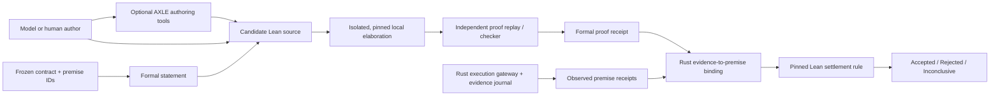

# AXLE and Envelope: authoring accelerator, not settlement authority

- **Research date:** July 18, 2026
- **Disposition:** candidate research; no promotion into `src/`
- **Repositories:** `AxiomMath/axiom-lean-engine@12b127845dceab7a2263abcbbc31b473d96a38b3` (v1.5.0) and `AxiomMath/axle-mcp-server@64842f52908299e9a32b1bfe21c4d624635c536c` (v0.3.5)

## Result

AXLE's best role in Envelope is an **optional, untrusted authoring accelerator**. Its extraction, decomposition, repair, merge, compilation, and fast proof-comparison tools can reduce the cost of producing candidate Lean. Neither the hosted `verify_proof` result nor the MCP wrapper should settle an Envelope contract.

The settlement path should instead elaborate the exact candidate in an isolated, locally pinned Lean project and replay it through a separately qualified checker. Rust should bind that formal result to the exact contract, empirical evidence, environment, and execution receipt. Lean then proves only the implication it can honestly prove:

> Given these typed, admissible premises, the contract's acceptance conclusion follows.

That preserves Envelope's existing split between formal, observed, and unresolved claims instead of laundering a remote service response or an external measurement into a theorem.

This refines, rather than changes, Envelope's provisional boundary: Lean owns what can be proved about acceptance, admissibility, and settlement; Rust owns execution and evidence; Python remains the experimental surface ([Envelope README](../../../README.md#roadmap)).

## Recommended boundary



AXLE is outside the settlement trust root. A failure from AXLE is authoring feedback, not rejection. A success is a candidate result, not acceptance. The local replay receipt and admissible empirical receipts are the inputs to reconciliation. Rust binds and records those inputs; it does not introduce a second acceptance rule alongside the Lean-owned rule.

## What the two repositories actually contain

### `axiom-lean-engine`

Despite the name, the inspected repository is the **Python SDK, CLI, endpoint metadata, examples, and documentation** for a hosted service, as its own README states ([source](https://github.com/AxiomMath/axiom-lean-engine/blob/12b127845dceab7a2263abcbbc31b473d96a38b3/README.md#L1-L5)). It does not contain the Lean metaprograms, executor, sandbox, gateway, or proof-checking service implementation described by the technical report.

The SDK is useful and unusually explicit about several operational distinctions:

- `run_one` distinguishes server, argument, Lean resource, Lean timeout, and runtime failures ([source](https://github.com/AxiomMath/axiom-lean-engine/blob/12b127845dceab7a2263abcbbc31b473d96a38b3/axle/client.py#L156-L190)). Resource and Lean timeout outcomes became deterministic, non-retryable types in v1.5.0 ([source](https://github.com/AxiomMath/axiom-lean-engine/blob/12b127845dceab7a2263abcbbc31b473d96a38b3/CHANGELOG.md#L13-L23)).
- The client retries only connection/service-unavailable and rate-limit failures, with exponential jitter bounded by its client timeout ([source](https://github.com/AxiomMath/axiom-lean-engine/blob/12b127845dceab7a2263abcbbc31b473d96a38b3/axle/client.py#L671-L696)). This is the right *kind* of retry classification, although Envelope must also journal attempts, queue time, and cost.
- Responses include processed content, diagnostics, failed declarations, optional negation, timings, and an unstructured `info` object ([source](https://github.com/AxiomMath/axiom-lean-engine/blob/12b127845dceab7a2263abcbbc31b473d96a38b3/axle/types.py#L21-L59)). They do not constitute a portable kernel certificate or local replay receipt.
- AXLE reports executor commit, image, and artifact identifiers in `info` ([source](https://github.com/AxiomMath/axiom-lean-engine/blob/12b127845dceab7a2263abcbbc31b473d96a38b3/CHANGELOG.md#L77-L84)). Those are valuable identity inputs, but a service assertion about itself is not an attestation that Envelope independently applied or verified.

The sharp trust limitation is documented, not inferred: `verify_proof` trusts the active Lean environment, and a sufficiently creative adversary can use metaprogramming to make an invalid proof appear valid. The project recommends an isolated checker for untrusted code and does not expect to remove this limitation ([source](https://github.com/AxiomMath/axiom-lean-engine/blob/12b127845dceab7a2263abcbbc31b473d96a38b3/docs/tools/verify_proof.md#L7-L21)). The [technical report](https://arxiv.org/html/2606.26442) demonstrates the same boundary with an environment-injection example that AXLE accepts and independent replay rejects. This is a deliberate throughput tradeoff, not an implementation accident.

Two API semantics are especially dangerous if copied into settlement:

1. `check.okay` means compilation succeeded. It remains true for `sorry`, disallowed axioms, and unsafe definitions; callers must inspect `failed_declarations` or use a stronger path ([source](https://github.com/AxiomMath/axiom-lean-engine/blob/12b127845dceab7a2263abcbbc31b473d96a38b3/docs/tools/check.md#L51-L77)).
2. `ignore_imports=true`, now the default, replaces the submitted imports with the environment's cached default header and returns the transformed source ([source](https://github.com/AxiomMath/axiom-lean-engine/blob/12b127845dceab7a2263abcbbc31b473d96a38b3/docs/tools/verify_proof.md#L83-L96)). Fast authoring may use that behavior, but settlement must bind and verify the processed source, imports, options, and dependency closure it actually checked.

Selective declaration elaboration is another authoring-only optimization. The changelog explicitly says unselected proof messages are incomplete or unreliable ([source](https://github.com/AxiomMath/axiom-lean-engine/blob/12b127845dceab7a2263abcbbc31b473d96a38b3/CHANGELOG.md#L13-L30)). Envelope's final checker must cover the complete acceptance artifact and dependency closure.

### `axle-mcp-server`

The MCP repository is a separate, thin adapter over the hosted HTTP API. It does not use the typed SDK. At process import it fetches the live endpoint and environment catalogs, chooses a default environment, and constructs the advertised tools ([source](https://github.com/AxiomMath/axle-mcp-server/blob/64842f52908299e9a32b1bfe21c4d624635c536c/axle_mcp_server/server.py#L385-L427)). Therefore identical source and package versions can expose different schemas and choose different Lean versions after a restart.

That is convenient for an interactive agent and the wrong identity model for a qualified settlement component:

- The schema projection is intentionally lossy: service field types collapse into a small JSON Schema map; unknown types become strings; dictionaries remain unstructured ([source](https://github.com/AxiomMath/axle-mcp-server/blob/64842f52908299e9a32b1bfe21c4d624635c536c/axle_mcp_server/server.py#L49-L67), [source](https://github.com/AxiomMath/axle-mcp-server/blob/64842f52908299e9a32b1bfe21c4d624635c536c/axle_mcp_server/server.py#L263-L303)).
- The adapter collapses the service's typed `internal_error`, `user_error`, and Lean/runtime `error` outcomes into generic `RuntimeError`, and returns output as JSON text without an MCP output schema ([source](https://github.com/AxiomMath/axle-mcp-server/blob/64842f52908299e9a32b1bfe21c4d624635c536c/axle_mcp_server/server.py#L96-L114), [source](https://github.com/AxiomMath/axle-mcp-server/blob/64842f52908299e9a32b1bfe21c4d624635c536c/axle_mcp_server/server.py#L448-L503)). This discards the error classification Envelope needs for pricing and retry policy.
- In stdio mode, `file_uri` gives the server local read authority. Roots constrain the read only when the client advertises the roots capability; a client without it is treated as unconstrained ([source](https://github.com/AxiomMath/axle-mcp-server/blob/64842f52908299e9a32b1bfe21c4d624635c536c/axle_mcp_server/server.py#L198-L260)). In Envelope, every file read must be a typed intent through the single execution gateway, with an allowed root and content digest.
- The package has lower-bound dependency ranges and no committed lock file; its container installs them dynamically and runs as the image's default user ([dependencies](https://github.com/AxiomMath/axle-mcp-server/blob/64842f52908299e9a32b1bfe21c4d624635c536c/pyproject.toml#L1-L35), [container](https://github.com/AxiomMath/axle-mcp-server/blob/64842f52908299e9a32b1bfe21c4d624635c536c/Dockerfile#L1-L13)). That image is not a frozen qualified target as written.

The MCP server can still be useful as a human- or agent-facing authoring convenience. It should not be Envelope's first integration. A narrow Envelope adapter around the typed SDK or raw API is simpler to freeze, can preserve error types, and avoids giving a broad dynamic tool catalog settlement authority.

## Lessons for Envelope's use of Lean

### 1. Separate the authoring and settlement planes

AXLE's strongest tools are transformations around proof production: extract declarations and dependencies, lift subgoals into lemmas, repair predictable failures, normalize, merge, and check a candidate quickly. The report's worked pattern—decompose, solve smaller obligations, repair, merge, then verify—is a promising way to reduce accepted-completion cost.

Every transformation must remain in the authoring plane. Envelope should journal the original formal statement, every transformed input/output digest, and the final candidate, then settle only the original frozen statement in the frozen local environment. A repaired or merged file is not trusted because the transformation was convenient.

### 2. Make the proof environment part of the contract identity

A qualified proof run needs at least:

- exact Lean toolchain and checker versions;
- exact dependency closure (`lake-manifest.json`, repository revisions, and artifact digests), not just “Mathlib” or `lean-4.x.y`;
- the effective import header and digest of both submitted and processed source;
- options such as `autoImplicit`, `relaxedAutoImplicit`, and definitional-equality policy;
- the permitted axiom policy; final settlement should not use `permitted_sorries` or name globs;
- theorem/declaration names and the complete checked dependency closure;
- adapter, endpoint-schema, executor, sandbox, and host identities;
- applied resource limits and observed termination reason.

Do not qualify `latest`, a live catalog default, or a mutable public environment name. On July 18, 2026 the [public environment catalog](https://axle.axiommath.ai/v1/environments) exposed ordinary `lean-4.21.0` through `lean-4.31.0` entries with `import Mathlib`, while their repository URL and revision fields were null. That is adequate discovery metadata, not the exact dependency identity Envelope requires.

### 3. Keep observations outside the theorem's trust claim

L1's four settlement gates are behavioral scenarios, strict typing, locked bootstrap, and affirmative human review. Lean can encode their composition and prove that accepted, admissible gate premises entail `Accepted`. It cannot prove that a process actually ran, the right filesystem was mounted, a human actually reviewed the source, or the recorded bytes came from the claimed run.

Rust should therefore own evidence acquisition and admissibility. Lean should receive typed premise witnesses identified by evidence IDs, not global axioms that pretend external observations are mathematical facts. The reconciliation record must preserve which claims are:

- formally proved;
- empirically supported or falsified;
- human-attested;
- unresolved.

This directly extends the claim-basis split in [`contract-harness-pricing.md`](../contract-harness-pricing.md#three-distinct-claim-bases).

### 4. Use a three-valued settlement result

Failure to find or elaborate a proof is not proof of negation. Timeout, resource exhaustion, unavailable service, missing dependency, and incomplete evidence should normally produce `Inconclusive`, not `Rejected`. `Rejected` needs an admissible failed gate or a checked refutation under the contract's settlement rule. AXLE's separate deterministic timeout/resource types and optional negation result are good interface precedents; Envelope must preserve them through its own adapter and independent checker.

### 5. Treat proof operations as measured harness components

For pricing, each proof operation needs a versioned component record: typed input/output, authority, evidence contribution, failure classes, retry policy, resource bounds, validity domain, and cost observables. Server timing excludes queue and network overhead, while the client may retry internally for much of its generous timeout. Record request attempts, queue/wall latency, remote timings, bytes, final classification, and local replay cost separately. Unknown usage remains unknown, never zero.

### 6. Prefer small, independently checkable obligations

AXLE's declaration extraction, dependency metadata, and subgoal lifting support a useful design pressure: compile a contract into small obligations with explicit dependencies, then independently check the final closure. Integer `type_hash` and `unfolded_type_hash` values may help authoring-time deduplication, but Envelope must use cryptographic digests for identity and must not infer semantic equivalence from hash equality alone.

### 7. Put AXLE behind the same authority and evidence rules as every tool

A remote proof call sends source outside the local boundary, consumes a credential and network authority, can retry, and can return mutable service metadata. In a qualified harness it must pass through the same typed execution gateway described in [`qualified-harnesses`](../qualified-harnesses/README.md#the-proposed-shared-harness-kernel), with prepared intent, bounded network destination, credential reference, request/response digests, and a terminal receipt. Installing an MCP server must not create a parallel execution path.

## Proposed first experiment

Keep the work in `exp/` and test one narrow L1 settlement slice before designing a general contract language.

1. Encode the composition of L1's four gates and `Accepted | Rejected | Inconclusive`; represent each non-formal gate as a typed, evidence-referenced premise.
2. Freeze one Lean toolchain, dependency lock, import header, option set, axiom policy, isolated elaborator image, and independent checker image.
3. Produce the same proof obligation in two randomized authoring arms:
   - local Lean feedback only;
   - local Lean plus the typed AXLE SDK for decomposition, repair, and advisory verification.
4. Run the identical local settlement path for both arms. AXLE output never enters reconciliation except as authoring history and measured cost.
5. Measure model calls/tokens, AXLE attempts and retries, local elaboration/checker time, remediation steps, wall latency, human attention, and whether both arms yield the same independently checked statement and dependency closure.

The experiment succeeds only if the formal claim remains honest and replayable, the AXLE arm can be removed without changing settlement semantics, and its marginal cost or completion benefit is measurable. Stop rather than shim if the exact dependency environment, transformed-source identity, or independent replay cannot be frozen.

A minimal proof receipt should carry:

```text
contract_digest
formal_statement_digest + theorem/declaration names
submitted_source_digest + processed_source_digest
Lean/dependency/import/options/axiom-policy identities
elaborator and independent-checker artifact identities
checked dependency closure and axioms used
proved | refuted | inconclusive + typed diagnostics
resource limits, timings, request/attempt IDs
local replay artifact digest
```

The Rust reconciliation record should reference this receipt alongside empirical and human evidence; the receipt should not embed a claim that those external premises are true.

## Graphify maps

Graphify's detected code, document, and image corpus for each repository was mapped in full with structural and semantic extraction: 14 code files, 27 documents, and 2 images for the engine; 9 code files, 1 document, and 1 GIF for the MCP server. No detected file was excluded as sensitive. Build and packaging files outside Graphify's detected types were inspected directly. The maps are navigation aids, not authoritative call graphs or proof evidence.

| Corpus | Scope | Graph | Report | Main signal |
|---|---:|---|---|---|
| `axiom-lean-engine@12b1278` | 43 files, ~49,464 words | [interactive map](maps/axiom-lean-engine/graph.html) | [report](maps/axiom-lean-engine/GRAPH_REPORT.md) | 429 nodes, 1,374 edges, 24 nontrivial communities; `AxleClient` and error types dominate, confirming that the repository's center is its remote adapter rather than a checker kernel |
| `axle-mcp-server@64842f5` | 11 files, ~80,139 words | [interactive map](maps/axle-mcp-server/graph.html) | [report](maps/axle-mcp-server/GRAPH_REPORT.md) | 162 nodes, 259 edges, 9 nontrivial communities; tool dispatch, live contract construction, environment defaults, and file authority dominate |

The engine graph's estimated query context is 12,718 tokens against a 65,952-token naive corpus, approximately 5.2× smaller. The MCP estimate is 3,004 tokens against a 106,852-token naive corpus, approximately 35.6× smaller. These are retrieval estimates, not runtime or proof-performance measurements.

The graph's “god nodes” and cross-community bridges are useful negative evidence: the engine map centers `AxleClient` (67 edges), exception classes, endpoint metadata, and CLI plumbing. The most useful inferred connections join negation checking with disproval and unfolded-type hashes with merge deduplication; both were verified against source before informing the recommendations above. Inferred graph edges remain hypotheses until source confirms them.

The MCP map centers `handle_call_tool` (31 edges), with `field_to_json_schema` and default-environment selection as the next structural hubs. Its most useful group relationships are the restart-bound live tool-contract pipeline and the `file_uri` authority flow. Together they expose the key review question: how can a live, dynamically translated tool contract be made part of an immutable harness identity? For settlement, the answer is to avoid that surface; for authoring, snapshot and digest it.

Graphify's generated cost files show zero model tokens because the Codex extraction agents did not expose token accounting to the pipeline. Semantic extraction did occur. Treat zero here as **unavailable accounting**, not zero use.

## Trust surface and limitations

What this research establishes:

- the architecture and semantics present in the two pinned public repositories;
- the documented trust limitation of hosted `verify_proof`;
- the MCP adapter's dynamic schema/default, authority, and error-classification behavior;
- the fit between those facts and Envelope's existing contract/harness boundary;
- a candidate experiment that can falsify AXLE's value without trusting AXLE to judge itself.

What it does not establish:

- the correctness, isolation, availability, or exact implementation of AXLE's hosted gateway and executors, because that implementation is absent from both repositories;
- that executor identity fields are remotely attestable or sufficient for replay;
- that any proposed independent Lean checker is qualified for Envelope;
- production cost or latency distributions;
- semantic correctness beyond the formal statement and admitted premises.

Both Python source and test trees passed bytecode compilation. The repository tests were inspected but not executed. Running their public dependency stacks required networked package installation; the attempted elevated test run was correctly denied because executing newly downloaded public code outside the sandbox could expose host secrets. Static inspection found 19 SDK test functions and 55 MCP test functions, concentrated on adapters, helpers, schemas, defaults, file-root behavior, handlers, and headers—not the absent server/verifier implementation. This absence is a limit, not evidence of failure.

The [AXLE technical report](https://arxiv.org/html/2606.26442) and the live public environment catalog provide context beyond the repositories. Claims derived from them are identified as such above. The report's throughput results describe AXLE's hosted design and internal workloads; they are not Envelope measurements.

## Review guide

The three places most worth direct verification are:

1. the adversarial `verify_proof` boundary and import substitution in [AXLE's verification documentation](https://github.com/AxiomMath/axiom-lean-engine/blob/12b127845dceab7a2263abcbbc31b473d96a38b3/docs/tools/verify_proof.md#L7-L21) and [input semantics](https://github.com/AxiomMath/axiom-lean-engine/blob/12b127845dceab7a2263abcbbc31b473d96a38b3/docs/tools/verify_proof.md#L83-L105);
2. the MCP server's live schema/default construction and local-file authority in [startup](https://github.com/AxiomMath/axle-mcp-server/blob/64842f52908299e9a32b1bfe21c4d624635c536c/axle_mcp_server/server.py#L385-L427) and [`file_uri` resolution](https://github.com/AxiomMath/axle-mcp-server/blob/64842f52908299e9a32b1bfe21c4d624635c536c/axle_mcp_server/server.py#L198-L260);
3. the proposed boundary between proof and observed evidence, against Envelope's current [`contract-harness-pricing.md`](../contract-harness-pricing.md#lean-acceptance-logic) and [`qualified-harnesses`](../qualified-harnesses/README.md#what-qualified-harness-should-mean-in-envelope) candidates.
