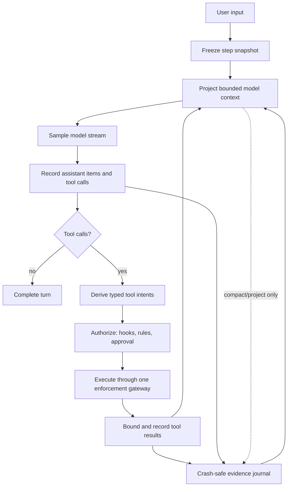
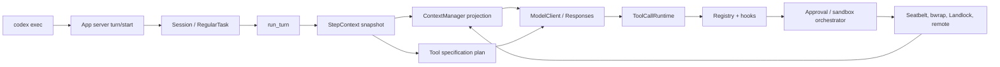
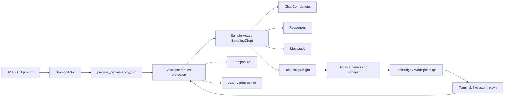
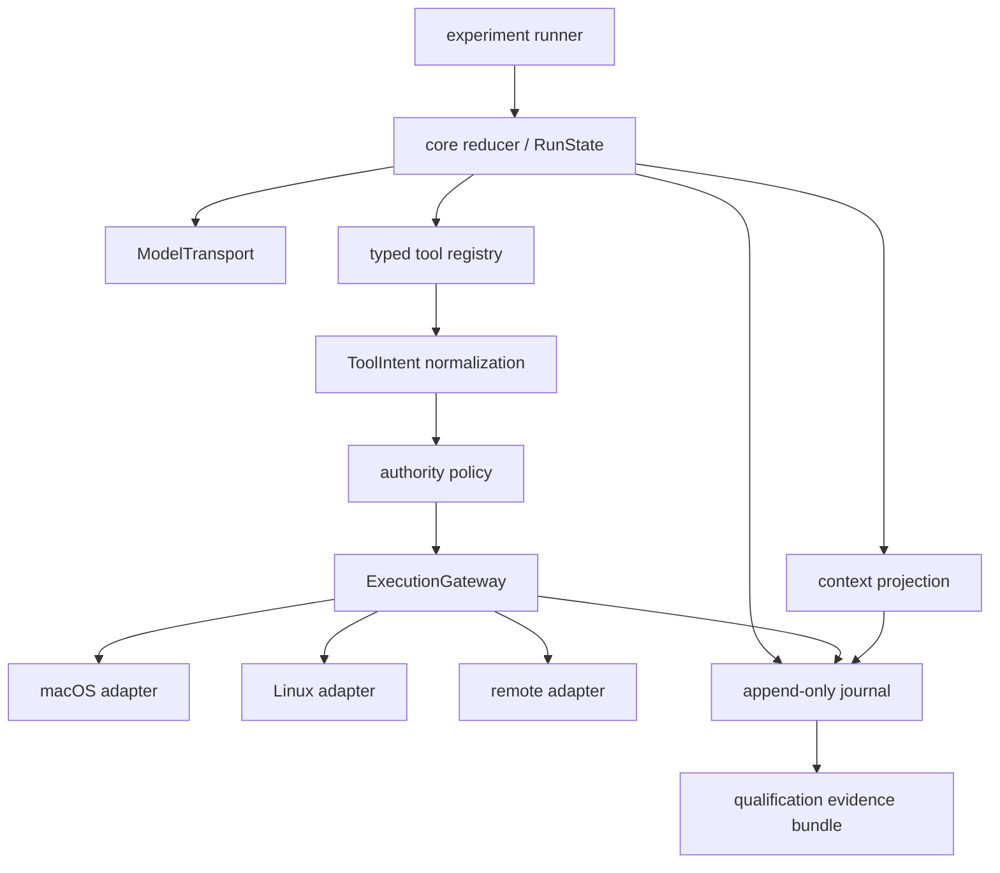

# Codex and Grok Build: anatomy of two Rust coding-agent harnesses

Status: experimental case study observed on 2026-07-15 for Envelope milestone 4, **Qualified task harnesses**. This artifact belongs in `exp/`; it is evidence and design input, not a promoted Envelope interface or schema.

Repositories inspected:

- [OpenAI Codex](https://github.com/openai/codex), local checkout at `/Users/engineer/ws/codex`, pinned to `365d70203da18c2a6f6848df3778e390e794ef17`.
- [xAI Grok Build](https://github.com/xai-org/grok-build), local checkout at `/Users/engineer/ws/grok-build`, pinned to `c1b5909ec707c069f1d21a93917af044e71da0d7`. Its README describes Grok Build as SpaceXAI's coding agent and this repository as a periodic sync from the SpaceXAI monorepo ([provenance](/Users/engineer/ws/grok-build/README.md:13)).

This is a static source study. The repositories were not compiled, their full test suites were not run, and no kernel-level sandbox claims were dynamically verified.

## Result in one paragraph

The reusable harness is not the CLI, TUI, provider SDK, or tool collection. The target Envelope kernel is a small state machine that snapshots one inference's authority, projects history into a deliberately bounded model request, samples, durably records tool intent before executing it, authorizes typed intent, executes through a measured OS boundary, records results, and decides whether to sample again. Neither repository implements all of those guarantees uniformly. Codex makes much of the loop easier to trace by narrowing inference to the Responses protocol and centralizing command-oriented execution authority. Grok Build pays more complexity to support three wire protocols, actor-owned state, richer compaction, and long-lived tools, but exposes stronger reusable type boundaries in its canonical conversation and typed tool layers. Neither repository shape should be copied wholesale. A first Envelope micro-harness should combine Codex's immutable step snapshot and deterministic tool-result ordering with Grok's typed tools and ordinary dangling-call repair, behind one execution gateway and a new crash-safe evidence journal.

The most important qualification conclusion is that **the same source commit on macOS and Linux is usually a different harness target class**. The actual filesystem, network, identity, path, helper, and failure semantics differ materially.

## Interactive maps

| Repository | Interactive HTML | Audit report | Raw graph | Focused source scope |
|---|---|---|---|---|
| Codex | [Open map](maps/codex/graph.html) | [Graphify report](maps/codex/GRAPH_REPORT.md) | [graph.json](maps/codex/graph.json) | [71 files](scope/codex-files.txt) |
| Grok Build | [Open map](maps/grok-build/graph.html) | [Graphify report](maps/grok-build/GRAPH_REPORT.md) | [graph.json](maps/grok-build/graph.json) | [71 selected files](scope/grok-build-files.txt) |

The Codex map contains 2,330 nodes, 5,940 edges, and 32 manually named communities. The Grok Build map contains 4,508 nodes, 12,482 edges, and 50 communities. Both maps are intentionally focused on ingress, session/turn ownership, providers, prompts, tools, context, persistence, permissions, process execution, and macOS/Linux enforcement. TUI, updater, most telemetry, marketplace, and other product surface are excluded.

## What “qualified harness” should mean in Envelope

Envelope already treats harness, tools, retries, context, and human help as experimental variables rather than hidden confounders ([comparability criteria](../FOUNDATIONS_RESEARCH_2026-07-10.md#24-comparability-is-the-real-prerequisite)). Its layered identity model places the harness, runtime, tools, policy, custody, and evidence in target-class identity—not only in run metadata ([identity layers](../FOUNDATIONS_RESEARCH_2026-07-10.md#54-identity-must-be-layered)). That makes milestone 4 more precise:

> A qualified harness is a versioned, measured execution configuration, not a product name.

For this study, the working identity is:

```text
qualified harness target class
  = source + build
  × model/provider route and wire protocol
  × effective prompt and instruction inputs
  × advertised tools, executable tools, and authority
  × context projection and compaction state machine
  × retry, concurrency, cancellation, and persistence policy
  × requested and actually applied sandbox
  × execution host, user identity, kernel, and helper provenance
  × evidence and validity interval
```

Changing any factor may create a neighboring target class. Envelope can later prove that some differences are immaterial, but it should not assume equivalence before evidence exists. This follows the intervention-graph framing in the foundations research, which explicitly includes provider, prompt/harness, tool authority, runtime, kernel, and policy as controlled mutations ([intervention dimensions](../FOUNDATIONS_RESEARCH_2026-07-10.md#89-computation-object-perturbation-and-local-geometry)).

## The proposed shared harness kernel

The source architectures motivate the following Envelope target loop. It is a synthesis, not a claim that either repository already provides one immutable authority snapshot, one universal enforcement gateway, complete write-ahead evidence, or universal model-input bounds.



The critical distinction is between the **durable journal** and the **model-visible projection**. The journal records what happened. The projection is a bounded, normalized, possibly compacted view used for the next inference. Conflating them makes compaction destructive, resume ambiguous, and evidence incomplete.

The core harness has seven responsibilities:

1. **Model transport:** convert one canonical request into a normalized event stream.
2. **Turn state machine:** decide when to sample, dispatch tools, continue, compact, retry, or terminate.
3. **Context projection:** preserve call/result integrity while fitting the model's current window.
4. **Tool protocol:** expose stable schemas, parse calls, bound outputs, and retain call identity.
5. **Authority and execution:** turn raw tool JSON into explicit command/path/network intent, approve it, and route every effect through one enforcement interface.
6. **Lifecycle control:** bound turns, retries, time, output, process trees, cancellation, and child agents.
7. **Evidence:** append decisions, requests, responses, side effects, enforcement receipts, and failures in replayable order.

Everything else is optional product surface until an experiment proves otherwise.

## Architectural comparison

| Dimension | OpenAI Codex | xAI Grok Build | Design lesson |
|---|---|---|---|
| Turn owner | Central `Session` task lifecycle around `run_turn` | `SessionActor` plus `ChatStateActor`, sampler actor, persistence actors | Start with one owner; add actors only for real concurrent producers |
| Inference protocols | Responses only | Chat Completions, Responses, Messages | Protocol breadth is a cross-cutting tax, not a free provider abstraction |
| Provider surface | Several endpoint/auth/catalog configurations behind a Responses-shaped core | Closed backend enum and concrete client around a canonical conversation IR | Own the canonical IR, but implement only protocols demanded by experiments |
| Per-inference snapshot | Explicit immutable `StepContext` | State is actor-owned; request is assembled from current actor/config state | Freeze advertised capability and execution authority together |
| Tool concurrency | Starts parallel work, commits results through `FuturesOrdered` | Sequential preflight, then `FuturesUnordered`; path locks for recognized keys | Pick and test history ordering separately from execution concurrency |
| Prompt strategy | Model-specific base instructions plus incremental contextual diffs | Rendered `PromptContext`, cached system prompt, runtime reminders | Hash the effective prompt, not just a template filename |
| Context | Append-ordered history, normalization, local/remote compaction, replacement checkpoints | Canonical conversation, request-only pruning, layered compaction, JSONL persistence | Keep durable history and request projection separate |
| Sandbox scope | Per execution attempt; approval can permit an unsandboxed retry | Process-wide filesystem sandbox fixed at startup; permissions cannot relax it | Policy and enforcement are independent dimensions |
| Linux | bwrap always uses user/PID namespaces; network namespace and seccomp are conditional on network mode; Landlock is a separate legacy path | Landlock process policy, optional bwrap deny overlays, terminal-only partial syscall filter | Record exact mechanism, mode, and every covered spawn class |
| macOS | Per-command Seatbelt profile | Process-wide nono/Seatbelt filesystem policy; child-network filter is a no-op | “Strict” has different semantics across OSes |
| Persistence | In-memory history and best-effort rollout append precede dispatch; replacement-history checkpoints aid resume | Chat history can be hard-cleared/replaced; update/history JSONL persistence is async and not established as a complete journal | Build a separate crash-safe write-ahead evidence log |
| Loop bounds | No intrinsic ordinary inference/tool/time bound; optional rollout budgets | `max_turns` only counts tool-bearing inner-loop iterations; wait/terminal controls are local rather than aggregate run bounds | Aggregate bounds belong in the minimal kernel |

## OpenAI Codex: core harness anatomy

### Ingress and ownership

The current `codex exec` path is a client of the same app-server protocol used by other frontends. The CLI dispatches into the exec client ([CLI dispatch](/Users/engineer/ws/codex/codex-rs/cli/src/main.rs:987)); exec starts or resumes a thread and sends `turn/start` ([exec client](/Users/engineer/ws/codex/codex-rs/exec/src/lib.rs:795)); the app-server translates that to `Op::UserInput` ([turn processor](/Users/engineer/ws/codex/codex-rs/app-server/src/request_processors/turn_processor.rs:510)); and the session actor starts a `RegularTask` ([session handler](/Users/engineer/ws/codex/codex-rs/core/src/session/handlers.rs:192)).

The submission channel is bounded at 512 items, while the outward event channel is unbounded ([session channels](/Users/engineer/ws/codex/codex-rs/core/src/session/mod.rs:533)). The bounded input is a useful backpressure decision. The unbounded output means a stalled consumer remains a memory-risk hypothesis requiring load testing.

### Reasoning loop

The reasoning loop is [`run_turn`](/Users/engineer/ws/codex/codex-rs/core/src/session/turn.rs:144). A turn can compact, freeze a `StepContext`, append context changes and user input, build a prompt, stream a response, execute calls, append results, and sample again. Continuation is driven by tool calls, `end_turn=false`, hooks, or pending input.

`StepContext` is the most valuable Codex pattern. It captures environment selection, capability roots, tools/MCP state, AGENTS.md state, and turn settings once ([type](/Users/engineer/ws/codex/codex-rs/core/src/session/step_context.rs:11), [capture](/Users/engineer/ws/codex/codex-rs/core/src/session/mod.rs:2849)). The model sees tool specifications derived from that snapshot, and the resulting `ToolInvocation` retains the same snapshot. This prevents capability drift between advertisement and execution.

The request type itself is intentionally small: history items, tool specs, `parallel_tool_calls`, base instructions, and an optional output schema ([Prompt](/Users/engineer/ws/codex/codex-rs/core/src/client_common.rs:16)). This is a good micro-harness boundary.



### Providers and models

Codex is provider-plural but protocol-narrow. `ModelProvider` handles authentication, account state, capability flags, error mapping, and model catalogs ([provider trait](/Users/engineer/ws/codex/codex-rs/model-provider/src/provider.rs:96)). But `WireApi` has one variant—`Responses` ([wire API](/Users/engineer/ws/codex/codex-rs/model-provider-info/src/lib.rs:54))—and `ModelClient` constructs a Responses request ([request construction](/Users/engineer/ws/codex/codex-rs/core/src/client.rs:823)). A third-party endpoint therefore needs a Responses-compatible surface or a deeper core adapter.

This constraint buys simplicity. Stream events, reasoning items, tool calls, usage, and continuation semantics do not need three-way translation. It also means the provider trait should not be mistaken for provider-neutral inference.

`ModelInfo` is more reusable: it gathers context window, compaction threshold, instructions, modalities, tool form, parallel-call support, reasoning controls, and capability selectors ([model metadata](/Users/engineer/ws/codex/codex-rs/protocol/src/openai_models.rs:366)). A qualified harness must record the effective capability record, not merely the model slug.

### Prompts and context

Base-instruction precedence is explicit: configuration override, persisted session metadata, then current model instructions ([precedence](/Users/engineer/ws/codex/codex-rs/core/src/session/mod.rs:595)). Initial context combines permission policy, developer instructions, collaboration/personality settings, skills/plugins, extension fragments, token-budget hints, and world state. Later steps append diffs rather than rewriting the prefix, preserving prompt-cache stability ([incremental updates](/Users/engineer/ws/codex/codex-rs/core/src/session/mod.rs:3553)).

AGENTS.md discovery walks root to current directory, observes override precedence, and applies a shared 32 KiB project-documentation budget ([discovery](/Users/engineer/ws/codex/codex-rs/core/src/agents_md.rs:89)). Changes are represented as appended replacement/removal context. A sharp edge is that a live session's ordinary refresh key is environment selection, not file content, so same-path edits can remain stale until a cold reconstruction ([manager](/Users/engineer/ws/codex/codex-rs/core/src/agents_md_manager.rs:31)).

`ContextManager` holds ordered model history and reference snapshots ([history](/Users/engineer/ws/codex/codex-rs/core/src/context_manager/history.rs:36)). Before a request it repairs dangling calls with stable aborted outputs, removes orphan outputs, and strips unsupported images ([normalization](/Users/engineer/ws/codex/codex-rs/core/src/context_manager/normalize.rs:15)). Token pressure combines server usage with coarse local byte estimates. Auto-compaction separately checks the active compaction scope and full context window ([window logic](/Users/engineer/ws/codex/codex-rs/core/src/session/context_window.rs:23)). This does not establish a universal per-item bound: contextual fragments accept unrestricted text, global instructions lack the same project-document cap, and compaction can aggregate a large retained-user item. Universal bounds remain a target requirement.

Local compaction preserves recent user messages under an aggregate budget, adds a generated summary, advances a context-window identity, and writes a replacement-history checkpoint ([local compaction](/Users/engineer/ws/codex/codex-rs/core/src/compact.rs:221)). Resume reverse-scans for the newest surviving checkpoint and replays only its tail ([reconstruction](/Users/engineer/ws/codex/codex-rs/core/src/session/rollout_reconstruction.rs:112)). That journal/checkpoint split is worth copying.

### Tools, ordering, and execution

The stream parser creates a typed `ToolCall` ([router](/Users/engineer/ws/codex/codex-rs/core/src/tools/router.rs:111)). Codex records the model's call in memory and attempts rollout persistence before execution ([stream handling](/Users/engineer/ws/codex/codex-rs/core/src/stream_events_utils.rs:319)), then dispatches through one registry that owns unknown-tool handling, payload validation, telemetry, hooks, execution, and model-visible result replacement ([registry](/Users/engineer/ws/codex/codex-rs/core/src/tools/registry.rs:408)). Persistence failure is logged and execution can continue, so this is not a crash-safe write-ahead guarantee ([persistence call](/Users/engineer/ws/codex/codex-rs/core/src/session/mod.rs:3479)). Command-oriented tools then enter a common approval/sandbox orchestrator; MCP, dynamic, subagent, and internal tools do not all pass through that OS execution gateway.

Parallel-capable tools share a read lock; exclusive tools take a write lock ([parallel runtime](/Users/engineer/ws/codex/codex-rs/core/src/tools/parallel.rs:94)). Work can start concurrently before the response stream ends, but `FuturesOrdered` commits results in model-call order ([turn drain](/Users/engineer/ws/codex/codex-rs/core/src/session/turn.rs:1908)). This gives deterministic history at the cost of head-of-line blocking behind a slow earlier tool.

Approval, sandbox choice, command transformation, attempt execution, denial classification, and escalation are separate layers ([orchestrator](/Users/engineer/ws/codex/codex-rs/core/src/tools/orchestrator.rs:137)). Read-denied paths are deliberately non-escalatable ([deny-read rule](/Users/engineer/ws/codex/codex-rs/core/src/tools/sandboxing.rs:242)). The design is traceable, but a sandbox-denied command may have completed earlier allowed side effects before the entire command is retried with more authority. Side-effecting retry needs an idempotency or committed-delta protocol; approval alone does not make replay safe.

## xAI Grok Build: core harness anatomy

### Ingress and ownership

Grok Build composes a large `SessionActor` in [`spawn_session_actor`](/Users/engineer/ws/grok-build/crates/codegen/xai-grok-shell/src/session/acp_session_impl/spawn.rs:91). Its event loop permits one active `AgentTask` and prioritizes queued user input ([run loop](/Users/engineer/ws/grok-build/crates/codegen/xai-grok-shell/src/session/acp_session_impl/run_loop.rs:33), [task gate](/Users/engineer/ws/grok-build/crates/codegen/xai-grok-shell/src/session/acp_session_impl/notification_drain.rs:22)). `ChatStateActor` separately owns conversation state and serializes mutations ([chat state](/Users/engineer/ws/grok-build/crates/codegen/xai-chat-state/src/actor/mod.rs:28)).

This actor decomposition is justified by the product's simultaneous UI, persistence, notifications, long-running terminals, and subagents. It is not the right default for a micro-harness. One mutable `RunState` is easier to reason about until two independent producers genuinely need serialized access.

### Reasoning loop

[`handle_prompt`](/Users/engineer/ws/grok-build/crates/codegen/xai-grok-shell/src/session/acp_session_impl/turn.rs:210) normalizes and persists input. [`process_conversation_turn_with_recovery`](/Users/engineer/ws/grok-build/crates/codegen/xai-grok-shell/src/session/acp_session_impl/turn.rs:1346) adds completion requirements and bounded recovery around [`process_conversation_turn`](/Users/engineer/ws/grok-build/crates/codegen/xai-grok-shell/src/session/acp_session_impl/turn.rs:1693).

Each loop iteration injects reminders/interjections, evaluates compaction, asks `ChatStateActor` for a canonical request, samples, records usage and response items, and either completes or executes calls. `max_turns` is checked only after tool-bearing batches ([turn bound](/Users/engineer/ws/grok-build/crates/codegen/xai-grok-shell/src/session/acp_session_impl/turn.rs:2288)); no-tool resubmissions can bypass that counter, and a new `process_conversation_turn` invocation resets it. The sampler bridge returns response, compact-and-resubmit, auth-refresh-and-resubmit, or terminal error ([sampler turn](/Users/engineer/ws/grok-build/crates/codegen/xai-grok-shell/src/session/acp_session_impl/sampler_turn.rs:860)). A foreground subagent wait budget can move a child to the background rather than terminate it, so it is not a child-lifetime bound.



### Providers and canonical conversation

Grok Build is protocol-plural. `ApiBackend` is a closed enum for Chat Completions, Responses, and Messages ([backend enum](/Users/engineer/ws/grok-build/crates/codegen/xai-grok-sampling-types/src/types.rs:1010)). `SamplingConfig` makes base URL, model, headers, context size, and backend data-driven. A canonical conversation layer translates items and semantics across those APIs ([conversation IR](/Users/engineer/ws/grok-build/crates/codegen/xai-grok-sampling-types/src/conversation.rs:1)).

The boundary is still not fully open: `SamplingClient` is concrete ([client](/Users/engineer/ws/grok-build/crates/codegen/xai-grok-sampler/src/client.rs:275)), provider-specific headers and context details live there, and adding a fourth wire protocol requires enum, conversion, stream, and match changes. The accurate description is **protocol adapters around an xAI-shaped canonical core**, not arbitrary provider polymorphism.

For a micro-harness, this is the right long-term direction but the wrong starting breadth. Define an owned request/event model and one transport trait, implement one protocol, and add a second only when an experiment reveals which fields are genuinely stable.

### Prompts and context

`Agent` bundles definition, prompt context, rendered system prompt, tool bridge, and context policies ([agent](/Users/engineer/ws/grok-build/crates/codegen/xai-grok-agent/src/agent.rs:14)). `AgentBuilder` discovers skills, finalizes tools, seeds AGENTS.md rules, builds `PromptContext`, and renders the system prompt ([builder](/Users/engineer/ws/grok-build/crates/codegen/xai-grok-agent/src/builder.rs:648)). `PromptContext::render` supports extending a base template or replacing it with a full custom body ([render](/Users/engineer/ws/grok-build/crates/codegen/xai-grok-agent/src/prompt/context.rs:251)). Tool names are resolved while rendering, so the effective prompt identity depends on the finalized registry.

System-prompt resume semantics are explicit, and large user prompts are bounded and offloaded with head/tail preservation ([prompt install](/Users/engineer/ws/grok-build/crates/codegen/xai-grok-shell/src/session/acp_session_impl/prompt_build.rs:92)). This is good evidence behavior: preserve the full artifact outside the model view and insert a bounded reference.

Token pressure combines last reported total usage with a byte estimate for locally appended material ([state estimate](/Users/engineer/ws/grok-build/crates/codegen/xai-chat-state/src/actor/state.rs:106)). Request construction prunes old tool results above a context fraction, protects recent turns, clears sufficiently old results, and compacts images under a byte ceiling ([request builder](/Users/engineer/ws/grok-build/crates/codegen/xai-chat-state/src/actor/request_builder.rs:20)). Some pruning is request-only, but Grok also hard-clears old tool results in memory and persisted chat history ([mutations](/Users/engineer/ws/grok-build/crates/codegen/xai-chat-state/src/actor/mutations.rs:165)), and compaction replaces persisted history. `updates.jsonl` retains replay material, but this study did not establish it as a complete, crash-safe evidence journal; persistence is asynchronous and best-effort.

Compaction is sophisticated: summary-space reservation, retry, progressively lossier fitting, orphan repair of the compacted output, replacement history, checkpoint persistence, and background prefire ([compaction](/Users/engineer/ws/grok-build/crates/codegen/xai-grok-shell/src/session/compaction.rs:811)). It is robust product machinery but far too much for a first micro-harness. Start with one measured compaction rule and add a separate unabridged evidence journal.

### Typed tools and concurrency

Grok's strongest reusable Rust boundary is the typed `Tool` trait: associated argument/output types, `Deserialize`, `JsonSchema`, serializable output, and a streaming result contract ([tool trait](/Users/engineer/ws/grok-build/crates/common/xai-tool-runtime/src/tool.rs:32)). The trait specifies progress followed by exactly one terminal item. The default dynamic consumer enforces that a terminal item exists, then returns on the first terminal; it does not detect a second terminal or later progress ([dispatch](/Users/engineer/ws/grok-build/crates/common/xai-tool-runtime/src/dispatch.rs:42)). `ToolBridge` owns definitions, parsing, rendering, and finalized dispatch ([bridge](/Users/engineer/ws/grok-build/crates/codegen/xai-grok-tools/src/bridge.rs:48)).

`execute_tool_calls` performs parsing, hooks, planning gates, and permission checks sequentially, then inserts approved work into `FuturesUnordered` ([tool calls](/Users/engineer/ws/grok-build/crates/codegen/xai-grok-shell/src/session/acp_session_impl/tool_calls.rs:284)). Results therefore arrive in completion order. Recognized same-path calls share locks, but generic lock extraction sees only selected top-level JSON keys ([lock extraction](/Users/engineer/ws/grok-build/crates/codegen/xai-grok-shell/src/session/acp_session_impl/tool_dispatch.rs:35)). This is weaker than deriving resource locks from a typed intent.

The tool layer is not an independent clean-room comparison. Grok's notice states that apply-patch/read/grep/list implementations were ported from Codex and several other tools from OpenCode ([third-party notice](/Users/engineer/ws/grok-build/crates/codegen/xai-grok-tools/THIRD_PARTY_NOTICES.md:3)). Similar tool behavior is partly shared lineage, not necessarily convergent design by two labs.

## macOS versus Linux: enforcement is part of identity

### Platform matrix

| Qualified target candidate | Filesystem enforcement | Network enforcement | Process and identity semantics | Qualification caveat |
|---|---|---|---|---|
| `codex/macos-seatbelt/local` | Per-command Seatbelt SBPL through absolute `/usr/bin/sandbox-exec` | Profile can allow, deny, or constrain through managed proxy rules | Same host account/uid; restriction inherited by child process tree | Record macOS build, filesystem aliases/case mode, profile digest, and actual probe results |
| `codex/linux-bwrap/{network-mode}/local` | bwrap mount namespace and filesystem plan | Network namespace and/or proxy-focused seccomp only for isolated/proxy modes; full-network mode uses neither | User and PID namespaces are requested; no alternate application account is selected | Record kernel, arch, network mode, user-namespace availability/mapping, bwrap path/version/digest, container/root state |
| `codex/linux-landlock/local` | Legacy Landlock filesystem rules | In-thread seccomp where selected | Same kernel and credential authority | Landlock ABI and kernel configuration are target identity |
| `grok/macos-seatbelt/fs-only` | Process-wide nono/Seatbelt filesystem policy | Parent remains networked; child filter is a non-Linux no-op | Same host account/uid; filesystem policy is irreversible for process lifetime | Do not label this network-restricted |
| `grok/linux-landlock/terminal-partial-filter` | Process-wide Landlock | Parent remains networked; terminal implementations install a partial seven-syscall deny filter | Base process retains host identity | This is not verified network isolation; hooks and other spawn sites differ |
| `grok/linux-landlock+bwrap-denies/terminal-partial-filter` | Landlock plus bwrap bind-over for supplemental deny paths/globs | Same terminal-only partial filter | Grok's bwrap invocation does not itself request separate user/PID/net namespaces | bwrap is PATH-resolved; launch marker and glob snapshot semantics matter |
| Either remote executor | Remote-host-defined | Remote-host-defined | Remote user/kernel/path namespace | Local policy request is not proof of remote enforcement |

Codex's sandbox selection and wrappers are centralized in [`SandboxManager`](/Users/engineer/ws/codex/codex-rs/sandboxing/src/manager.rs:34). macOS network policy is compiled into Seatbelt rules ([Seatbelt network construction](/Users/engineer/ws/codex/codex-rs/sandboxing/src/seatbelt.rs:274)). The modern Linux bwrap path always establishes user and PID namespaces plus filesystem mounts; it adds a network namespace and network seccomp only for restricted or proxy-routed modes ([bwrap construction](/Users/engineer/ws/codex/codex-rs/linux-sandbox/src/bwrap.rs:267)). Full-network filesystem sandboxing uses neither network control. Landlock is a separate legacy filesystem path; its child can install network seccomp when the selected network policy requires it ([legacy restrictions](/Users/engineer/ws/codex/codex-rs/linux-sandbox/src/landlock.rs:165)). If an already selected bwrap mechanism fails, the launcher does not silently fall back ([launch behavior](/Users/engineer/ws/codex/codex-rs/linux-sandbox/src/linux_run_main.rs:200)). Separately, initial platform selection can yield no sandbox when no supported mechanism is enabled, so requested policy and selected/applied mechanism must be recorded separately.

Grok applies its filesystem sandbox to the entire process at startup and keeps child-network filtering separate ([sandbox design](/Users/engineer/ws/grok-build/crates/codegen/xai-grok-sandbox/src/lib.rs:8)). Linux uses Landlock through nono, with bwrap overlays where Landlock cannot express deny-within-allow. macOS emits Seatbelt deny rules. Linux deny globs are expanded against existing paths at launch; macOS uses runtime regex rules that can cover future matching paths ([deny glob behavior](/Users/engineer/ws/grok-build/crates/codegen/xai-grok-sandbox/src/deny/glob.rs:249)). Those are not equivalent policies.

### Network scope is per spawn class

Grok's successful read-only/strict setup can set a “restrict child network” flag, but the actual filter is Linux-only ([Linux filter](/Users/engineer/ws/grok-build/crates/codegen/xai-grok-sandbox/src/child_net.rs:42)); the non-Linux implementation is a no-op ([non-Linux path](/Users/engineer/ws/grok-build/crates/codegen/xai-grok-sandbox/src/child_net.rs:105)). Installation is visible in terminal spawn paths ([terminal](/Users/engineer/ws/grok-build/crates/codegen/xai-grok-tools/src/computer/local/terminal.rs:2735)), while hook commands have their own spawn path ([hook runner](/Users/engineer/ws/grok-build/crates/codegen/xai-grok-hooks/src/runner/command.rs:145)). Therefore:

- Grok macOS strict/read-only is filesystem-only for child isolation.
- Grok Linux terminal implementations install a seven-syscall deny filter while the harness parent, model calls, hooks, MCP processes, or other spawn classes retain network. The filter defaults other syscalls to allow, omits `sendmmsg` and `io_uring` operations, and does not validate `seccomp_data.arch`; it is a partial control, not established network isolation.
- A single Boolean such as `network_restricted=true` is not a valid qualification field. Record parent and each child-spawn class separately.

Codex routes ordinary command execution through a more centralized gateway, so per-call network policy is easier to reason about. Remote exec is still a separate trust boundary: the client sends sandbox context to the remote server rather than applying a local OS sandbox ([remote execution path](/Users/engineer/ws/codex/codex-rs/core/src/tools/sandboxing.rs:473)).

### Identities and permissions

Neither local sandbox is a VM or a separate human identity. macOS Seatbelt restricts a process running under the caller's account. Linux namespaces and seccomp change what a process can see or invoke, but the target still depends on host uid/gid mappings, root/container state, kernel, mounts, credentials inherited into the process, and helper provenance.

Application permission and kernel enforcement are different layers:

- Codex can ask for approval and retry an execution without its ordinary sandbox. Denied-read constraints prevent that escalation. The effective target can therefore change per attempt.
- Grok's process-wide filesystem sandbox cannot be relaxed by a per-tool approval. Its permission manager controls whether a tool may be attempted inside that fixed boundary.
- Grok pre-hook failures are fail-open; only an explicit deny blocks the tool ([hook dispatcher](/Users/engineer/ws/grok-build/crates/codegen/xai-grok-hooks/src/dispatcher.rs:15)). Hooks are advisory/policy code, not a kernel boundary.
- Grok's documented command policy gives deny/ask rules segmented treatment, but a broad allow such as `Bash(git *)` can match a compound raw command. Raw direct-tool paths are not uniformly canonicalized ([permissions guide](/Users/engineer/ws/grok-build/crates/codegen/xai-grok-pager/docs/user-guide/22-permissions-and-safety.md:253)).

Qualified identity should include `uid/euid/gid`, credentials made available, host and executor OS, kernel, architecture/ABI, root/container state, namespaces/mappings, filesystem mount/alias behavior, helper path and digest, requested policy, applied policy, approval decisions, and any escalation.

## Source findings that should become qualification tests

These are static findings, not dynamically reproduced exploits.

### 1. Grok's Linux bwrap marker is not containment evidence

`is_inside_bwrap()` checks only whether `__GROK_INSIDE_BWRAP` is present ([marker check](/Users/engineer/ws/grok-build/crates/codegen/xai-grok-sandbox/src/lib.rs:51)). A present marker suppresses re-exec, and startup exempts that state from the custom-profile fail-closed check ([startup](/Users/engineer/ws/grok-build/crates/codegen/xai-grok-shell/src/config/mod.rs:1292)). This suppresses the resolved bwrap deny plan, including supplemental read denies and the devbox/devbox-extending `/data` write-deny bind ([deny plan](/Users/engineer/ws/grok-build/crates/codegen/xai-grok-sandbox/src/lib.rs:386)). Linux supplemental read-deny rules require bwrap because Landlock cannot express those subpath exceptions ([deny implementation](/Users/engineer/ws/grok-build/crates/codegen/xai-grok-sandbox/src/deny/mod.rs:115)). No mount-namespace or helper attestation was found. The repository release entry point does not sanitize the marker; an out-of-repository packager might, but was not inspected.

Impact is limited but material: this requires control of the process launch environment; it is not a model-originated escape from an already-running session. A wrapper or deployment can unknowingly omit the requested bwrap overlay. A qualified target should either fix this with an inherited descriptor/namespace verification or probe the applied mount state and fail closed.

### 2. Grok apply-patch authority and locking do not match its prose contract

The tool description requires relative paths ([description](/Users/engineer/ws/grok-build/crates/codegen/xai-grok-tools/src/implementations/codex/apply_patch/tool.rs:88)), but the parser stores unvalidated `PathBuf`s ([parser](/Users/engineer/ws/grok-build/crates/codegen/xai-grok-tools/src/implementations/codex/apply_patch/parser.rs:201)) and `cwd.join(path)` permits absolute replacement and lexical `..` traversal ([execution](/Users/engineer/ws/grok-build/crates/codegen/xai-grok-tools/src/implementations/codex/apply_patch/tool.rs:152)). Permission sees exactly a generic `Edit("apply_patch")`, so path-specific managed permission rules inside the workspace are not evaluated, and generic path-lock extraction cannot see paths embedded inside the patch string. Concurrent patches can therefore miss same-file locking. A successfully applied local OS sandbox may still block outside-workspace writes, but that boundary is absent when a built-in profile continued without enforcement and is not proven for delegated remote execution. Codex's parser also deliberately accepts absolute paths; its stronger surrounding boundary comes from effective-path extraction, per-file authorization, and filesystem sandbox context, not parser rejection.

This is a design lesson for the harness, not merely one tool bug: derive `ToolIntent { reads, writes, command_segments, network, locks }` from parsed typed arguments before permission checks or scheduling.

### 3. Side-effecting retries need a commit protocol

Codex can rerun a whole command after sandbox denial and fresh approval. The first attempt may already have made allowed changes before encountering a denied action. Grok also has auth-recovery paths that can redispatch an approved tool closure ([auth retry](/Users/engineer/ws/grok-build/crates/codegen/xai-grok-shell/src/session/acp_session_impl/sampler_turn.rs:63)), including managed MCP recovery. Both patch engines apply changes sequentially rather than transactionally. A minimal harness should journal `Prepared(intent)`, acquire sorted resource locks, execute once, then record `Committed(delta)` or `Partial(delta, error)`. It should never blindly retry a side-effecting tool unless its idempotency key or observed committed state proves replay safe.

### 4. Configured and applied enforcement can diverge

Grok custom sandbox profiles generally fail closed, while failures applying built-in profiles can warn and continue ([startup behavior](/Users/engineer/ws/grok-build/crates/codegen/xai-grok-shell/src/config/mod.rs:1313)). Safety decisions such as automatic Bash approval consult applied state, but configured/profile metadata can still exist separately and must not be interpreted as proof of enforcement. Codex can select `SandboxType::None` when no supported platform wrapper is available ([selection](/Users/engineer/ws/codex/codex-rs/sandboxing/src/manager.rs:280)). Remote paths delegate enforcement. Every run therefore needs an **observed per-control applied-enforcement receipt**, not only configuration text.

## What to reuse in a Rust micro-harness

### Strong patterns

1. **Immutable step snapshot — from Codex.** Freeze the model, effective prompt digest, tool schemas, permission policy, environment roots, and sandbox target before sampling. Retain that snapshot on every emitted call.
2. **Typed tool contract — from Grok.** Use associated argument/output types and generated JSON Schema, then type-erase only at the model-facing registry boundary.
3. **Call/result repair — source pattern, stronger target invariant.** Codex routinely repairs dangling calls and removes orphan outputs. Grok's ordinary path deduplicates results and inserts missing results for dangling calls; orphan removal requires out-of-band repair or a compaction sanitation path. Envelope should enforce both before every request and synthesize explicit aborted results after cancellation or crash.
4. **Journal versus projection — required extension.** Both systems demonstrate useful history/projection or checkpoint seams, but neither proves a complete crash-safe evidence journal. Envelope should preserve complete events in a separate log and compact only the request view; replacement checkpoints accelerate replay without erasing evidence.
5. **Deterministic history — Codex.** Concurrent execution may complete out of order, but the model-visible ordering must be chosen, documented, and tested. Call IDs—not vector position—remain authoritative.
6. **Retry classification — Grok.** Separate transport retry, auth refresh, context overflow, malformed image recovery, and terminal failure. Never reuse that machinery for side-effecting tool replay.
7. **One execution gateway — stronger than either repository.** Every shell, hook, MCP child, auth helper, formatter, patch, and remote tool should declare intent and pass through one enforcement interface.
8. **Requested versus applied state — required by qualification.** An `AppliedSandbox` value should be constructible only after enforcement succeeds or a probe confirms it.
9. **Structured cancellation.** Own process groups/trees, kill descendants, bound drain time, and journal the interrupted boundary.
10. **Hard bounds everywhere model-visible.** Cap prompts, tool outputs, progress events, images, injected context fragments, iterations, elapsed time, cost, and child count.

### Patterns to defer

- App-server or ACP layers when the harness has one caller.
- Dynamic MCP/plugin loading before a fixed toolset is qualified.
- Multiple provider protocols before a second experiment requires one.
- Two-pass/background compaction before a simple policy is measured.
- Memories, reminders, todo gates, personas, and goal-recovery layers.
- Subagents before depth, sibling concurrency, aggregate budgets, and custody are explicit.
- Long-lived terminal actors when bounded one-shot execution is sufficient.
- Many crates merely to look modular.

The foundations research warns that only repeated, semantically stable structures should graduate into a shared IR and suggests ordinary experiment artifacts until roughly five experiments reveal those structures ([promotion threshold](../FOUNDATIONS_RESEARCH_2026-07-10.md#103-cross-experiment-extraction-sheet)). The first implementation should therefore be one experiment-local crate with clean modules. Split crates only when independent versioning, build boundaries, or reuse become real.

## Recommended micro-harness shape



Start with modules, not separate crates:

```text
src/
  protocol.rs       owned Message, ToolCall, ToolResult, Usage, StopReason, ModelEvent
  loop.rs           small explicit state machine and bounds
  context.rs        normalization, budgeting, one compaction strategy
  tools.rs          typed Tool trait, registry, output bounds, ToolIntent
  execution.rs      approval plus the only process/filesystem/network gateway
  journal.rs        append-only events, checkpoints, replay
  qualification.rs requested/applied identity and evidence receipt
```

The central loop should be boring:

```rust
loop {
    limits.check(&state)?;
    let step = StepSnapshot::freeze(&state, &configuration)?;
    let request = context.project(&journal, &step)?;
    let response = transport.sample(request, cancel.clone()).await?;
    journal.append(ModelResponse(response.clone()))?;

    let calls = response.tool_calls();
    if calls.is_empty() {
        return Ok(response.final_output());
    }

    let prepared = tools.parse_intents(calls, &step)?;
    let grants = authority.authorize(&prepared, &step).await?;
    let results = execution.execute_once(prepared, grants, cancel.clone()).await;
    journal.append_in_model_order(results)?;
}
```

The essential point is not the syntax. It is that sampling, authorization, and execution are separate effects; `StepSnapshot` binds what was advertised to what may execute; and the journal makes every transition replayable.

### Scale down first

The first useful harness can have:

- one provider, one pinned wire protocol, and one model capability record;
- one fixed system prompt and explicit project-instruction inputs;
- three tools: read, bounded search, and bounded command/patch through one gateway;
- one qualified OS target;
- one context estimator and one compaction policy;
- a finite turn/tool/time/cost budget;
- no TUI, MCP, plugins, hooks, memory, subagents, remote execution, or background jobs.

This is semantically minimal even if safe process handling and evidence code make it more than a tiny number of lines.

### Scale up only on evidence

- Add a second wire adapter when it reveals stable versus provider-specific IR fields.
- Add actor ownership when UI, persistence, or subagents become concurrent producers.
- Add dynamic tools only with a per-step capability snapshot and schema digest.
- Add a second OS as a new qualified target, not a feature flag assumed equivalent.
- Add subagents only with depth, sibling count, aggregate tokens/cost/time, cancellation, and workspace custody.
- Add remote execution only when the remote returns a verifiable host/enforcement receipt.

## Experimental qualification record

This is a candidate experiment record, not a promoted schema:

```yaml
harness_artifact:
  repository: openai/codex | xai-org/grok-build | local
  commit: sha256-or-git-oid
  binary_digest: sha256
  cargo_lock_digest: sha256
  rust_toolchain: exact
  target_triple: exact
  features: []
  build_profile: release

model_route:
  provider_account: qualified-reference
  endpoint_and_api_version: exact
  wire_backend: responses | chat_completions | messages
  model_id_or_alias: exact
  route_region_policy: observed-or-unknown
  sampling_and_reasoning: {}
  observed_capabilities_digest: sha256

effective_context:
  system_prompt_digest: sha256
  developer_prompt_digest: sha256
  project_instruction_files: [{path, digest, precedence}]
  tool_schema_digest: sha256
  advertised_tools: []
  executable_tools: []
  context_window: integer
  estimator: versioned
  compaction_policy: versioned
  durable_journal_policy: versioned

authority:
  permission_rules_digest: sha256
  approval_mode: exact
  remembered_grants: []
  escalations: []
  human_interventions: []
  tool_intent_and_lock_policy: versioned

execution_target:
  locality: local | remote
  host_os_version: exact
  executor_os_version: exact
  kernel_and_arch: exact
  uid_euid_gid: exact
  root_container_state: exact
  namespace_and_mount_state: measured
  credentials_exposed: named-set
  helper_paths_versions_digests: []
  cgroup_or_resource_controls: measured

enforcement:
  requested_policy_digest: sha256
  filesystem:
    roots_denies_and_alias_semantics: normalized-record
    controls:
      - {mechanism, scope, helper_digest, requested, applied, failure_mode, receipt}
  network:
    parent: {controls: [], applied, failure_mode, receipt}
    spawn_classes:
      terminal: {controls: [], applied, failure_mode, receipt}
      hook: {controls: [], applied, failure_mode, receipt}
      mcp: {controls: [], applied, failure_mode, receipt}
      helper: {controls: [], applied, failure_mode, receipt}
  identity_and_namespaces:
    controls: [{mechanism, requested, applied, failure_mode, receipt}]
  resource_controls:
    controls: [{mechanism, requested, applied, failure_mode, receipt}]
  attempts_and_escalations:
    - {attempt, authority, controls, observed_result}
  remote_host:
    requested_controls: []
    attested_controls: []
    downgrade_or_unknowns: []

run_policy:
  max_model_steps: integer
  max_tool_calls: integer
  max_parallel_tools: integer
  max_children: integer
  retry_policy: versioned
  timeout_and_cancel_policy: versioned
  output_and_memory_limits: versioned

evidence:
  journal_digest: sha256
  request_response_receipts: []
  tool_intents_decisions_results: []
  committed_side_effect_deltas: []
  enforcement_receipts: []
  provider_request_ids: []
  observation_time_and_validity: exact
```

The same binary on macOS and Linux should produce different `execution_target` and `sandbox` identities. Two records may later be comparable for task quality while remaining incomparable for custody or authority. Envelope's comparability relation should preserve that distinction rather than force a global “same harness” Boolean.

## Qualification tests implied by this study

### Loop and model protocol

- Script the model stream and prove every transition of `sample → record → dispatch → record → sample`.
- Prove tool calls are journaled before execution and paired with exactly one terminal result.
- Inject malformed, duplicated, dangling, and out-of-order calls.
- Prove iteration, time, cost, output, and child limits stop the loop deterministically.
- Prove transport retry never duplicates a tool side effect.

### Context and persistence

- Compare durable journal, request projection, compacted request, resume, and fork.
- Prove every model-visible item is bounded and truncation is explicit.
- Crash before intent, after prepared intent, during side effect, and before committed result.
- Verify prompt/tool/context digests change exactly when effective behavior changes.
- Measure summary information loss; do not treat successful serialization as semantic preservation.

### Tools and concurrency

- Derive read/write/network/lock intent from typed arguments, including patch contents.
- Run conflicting same-path calls and prove the chosen ordering.
- Cancel every tool phase and verify process-tree cleanup plus an aborted model-visible result.
- Verify output head/tail retention and full-artifact offload.
- Test partial changes and committed-delta reporting.

### macOS/Linux matrix

- Probe allowed and denied reads/writes through direct tools and every child-spawn class.
- Probe parent, terminal child, hook child, MCP child, and helper networking separately, including inherited sockets.
- Exercise `sendmmsg`, io_uring connect/send, and every enabled compat ABI; do not infer isolation from a short syscall deny list.
- Test symlink aliases, `..`, absolute paths, case variants, `/tmp` versus `/private/tmp`, future glob matches, and a nonexistent macOS deny path later created as a directory with children.
- Test absent/unusable bwrap, disabled user namespaces, old Landlock ABI, root and container modes.
- Pre-set containment markers and verify they cannot substitute for measured namespace state.
- Record helper absolute paths and digests; reject PATH shadowing.
- Make named controls fail and prove whether startup closes, degrades, or opens.

### Remote execution

- Require the executor to return host identity and applied-control evidence.
- Detect client/server policy downgrades, including Grok workspace-server mapping custom profiles to Workspace and continuing when enforcement is unavailable.
- Treat an unverifiable remote target as a distinct, weaker evidence profile.

## What the source tests do and do not establish

Codex contains strong integration tests around tool round trips, parallelism, prompt caching, AGENTS.md hierarchy, compaction/resume/fork, truncation, cancellation, and websocket fallback. These largely use mock Responses transports and inspect request/transcript behavior. Representative entry points include [tool harness](/Users/engineer/ws/codex/codex-rs/core/tests/suite/tool_harness.rs:60), [parallel tools](/Users/engineer/ws/codex/codex-rs/core/tests/suite/tool_parallelism.rs:91), [prompt caching](/Users/engineer/ws/codex/codex-rs/core/tests/suite/prompt_caching.rs:312), and [compact/resume/fork](/Users/engineer/ws/codex/codex-rs/core/tests/suite/compact_resume_fork.rs:126).

Grok Build has tests for token estimates, dangling-call repair, rejected parallel calls, crash repair, prompt replacement, retained-history pruning, retry classification, and JSONL persistence. Representative entry points include [chat-state tests](/Users/engineer/ws/grok-build/crates/codegen/xai-chat-state/src/actor/tests.rs:312), [retry tests](/Users/engineer/ws/grok-build/crates/codegen/xai-grok-sampler/src/retry.rs:462), and [JSONL tests](/Users/engineer/ws/grok-build/crates/codegen/xai-grok-shell/src/session/storage/jsonl/tests.rs:106).

The present study only inspected these tests. It does not prove:

- real compatibility with every advertised provider/protocol;
- tokenizer-accurate context budgeting or summary quality;
- crash atomicity around side-effecting tools;
- bounded memory under slow consumers or unbounded actor queues;
- same-file ordering for all concurrent Grok tools;
- sibling-subagent resource behavior;
- actual Seatbelt, Landlock, bwrap, seccomp, cgroup, or remote enforcement;
- behavior of packaging or launch wrappers outside the repositories.

Grok deny-path E2E tests may skip when enforcement prerequisites are unavailable unless explicitly required ([E2E test](/Users/engineer/ws/grok-build/crates/codegen/xai-grok-sandbox/tests/deny_paths_e2e.rs:292)). Runtime qualification must make skipped enforcement a failed or degraded target, not a passing test.

## Adversarial reading: how these architectures break

### Codex

- A provider that is not Responses-compatible cuts through core request/history/event types.
- `FuturesOrdered` gives stable history but can hide completed later results behind a slow earlier call.
- A stalled output consumer can grow the unbounded event channel.
- The ordinary loop has no intrinsic step/time/cost ceiling unless another feature supplies one.
- Compaction and many tool outputs are bounded, but unrestricted contextual fragments and global instructions mean there is no universal per-item model-input cap.
- Pre-turn compaction does not yet include incoming context diffs and user input in its estimate ([acknowledged TODO](/Users/engineer/ws/codex/codex-rs/core/src/session/turn.rs:154)).
- Same-path AGENTS.md edits can remain stale in a live session.
- History is updated before rollout persistence, and an append failure is logged rather than propagated ([persistence call](/Users/engineer/ws/codex/codex-rs/core/src/session/mod.rs:3479)).
- Unsandboxed retry can duplicate partial side effects.

### Grok Build

- A fourth wire protocol cuts across the closed backend enum and concrete client.
- The composition root and session actor carry many product responsibilities, obscuring the minimal invariant set.
- Async queues and sibling subagents need explicit aggregate bounds; `max_turns` and foreground wait timers are only local controls.
- Context quality depends on provider usage accuracy and lossy summaries; old tool output may be pruned before summarization, and persisted chat history is not an unabridged evidence journal.
- `FuturesUnordered` plus incomplete path extraction can violate intended edit ordering.
- Hooks fail open and individual spawn sites do not share uniform network enforcement; the Linux terminal filter is partial even where installed.
- macOS network restriction is nominal, not enforced.
- Linux bwrap overlay enforcement trusts an inherited marker.
- Built-in sandbox application can degrade to unsandboxed execution while configured/profile metadata remains separate from applied state.
- Authentication recovery can redispatch an already approved tool unless its side-effect semantics are proven safe.

## Map method and limitations

Graphify was run on focused, code-only Rust corpora:

- Codex: 71 files, approximately 141,778 words.
- Grok Build: 71 selected files; 70 accepted by detection, approximately 355,729 words. One selected file was conservatively skipped as sensitive; its name is intentionally not reproduced here.

Structural extraction used Graphify's Rust tree-sitter path. No semantic extraction agents were needed, so the recorded model-token cost is zero. The generated benchmark estimates approximately 4.7× token reduction for typical Codex graph queries and 7.1× for Grok queries; these are structural retrieval estimates, not harness quality or performance measurements.

The maps are navigation aids, not authoritative Rust call graphs:

- macros, trait-object dispatch, generic monomorphization, conditional compilation, and runtime registration are incomplete;
- some cross-file calls are name-matched at lower confidence and tagged `INFERRED` even though no language model was used;
- generic labels such as `new()` can create false bridges;
- inline test modules inside selected source files remain in the AST and can inflate centrality for test helpers;
- omitted product files create deliberate boundary gaps;
- community detection is descriptive, and labels were manually assigned after inspecting members and source paths.

Use the maps to find clusters and candidate paths, then verify every important edge in source.

## Final recommendation

Build the first Envelope harness **protocol-narrow, authority-explicit, and evidence-heavy**:

- Follow Codex in keeping one inference protocol at first, freezing an immutable step snapshot, preserving deterministic model history, and centralizing command execution authority—then extend that gateway to every effectful tool class.
- Follow Grok in owning canonical conversation types, using typed tools with schema generation, repairing call/result invariants, and classifying retries.
- Follow neither in adopting the full session composition, product integrations, or dispersed spawn surface.
- Put all effects behind one gateway and make it return an observed enforcement receipt.
- Treat macOS, Linux bwrap, Linux Landlock, and remote execution as different target classes until experiments prove a narrower equivalence.
- Keep this design in `exp/` until repeated harness experiments show which types and fields actually remain stable.

That gives Envelope a small Rust execution core consistent with its provisional language boundary—Rust owns execution and evidence ([Envelope README](/Users/engineer/ws/ev/README.md:46))—without prematurely promoting an abstraction before the experiments have earned it.

## Review guide

The most important places to verify directly are:

1. Codex's `StepContext` capture and `run_turn`/tool result ordering: [step context](/Users/engineer/ws/codex/codex-rs/core/src/session/step_context.rs:11), [turn loop](/Users/engineer/ws/codex/codex-rs/core/src/session/turn.rs:144).
2. Grok's turn loop, typed tool boundary, and sequential-preflight/concurrent-dispatch split: [turn](/Users/engineer/ws/grok-build/crates/codegen/xai-grok-shell/src/session/acp_session_impl/turn.rs:1693), [tool trait](/Users/engineer/ws/grok-build/crates/common/xai-tool-runtime/src/tool.rs:32), [tool calls](/Users/engineer/ws/grok-build/crates/codegen/xai-grok-shell/src/session/acp_session_impl/tool_calls.rs:284).
3. The platform claims and qualification blockers: [Codex sandbox manager](/Users/engineer/ws/codex/codex-rs/sandboxing/src/manager.rs:280), [Grok child network](/Users/engineer/ws/grok-build/crates/codegen/xai-grok-sandbox/src/child_net.rs:42), [Grok bwrap marker](/Users/engineer/ws/grok-build/crates/codegen/xai-grok-sandbox/src/lib.rs:51), and [Grok apply-patch execution](/Users/engineer/ws/grok-build/crates/codegen/xai-grok-tools/src/implementations/codex/apply_patch/tool.rs:152).
